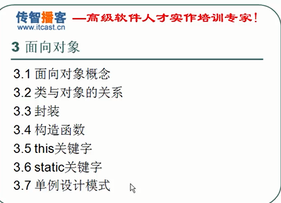
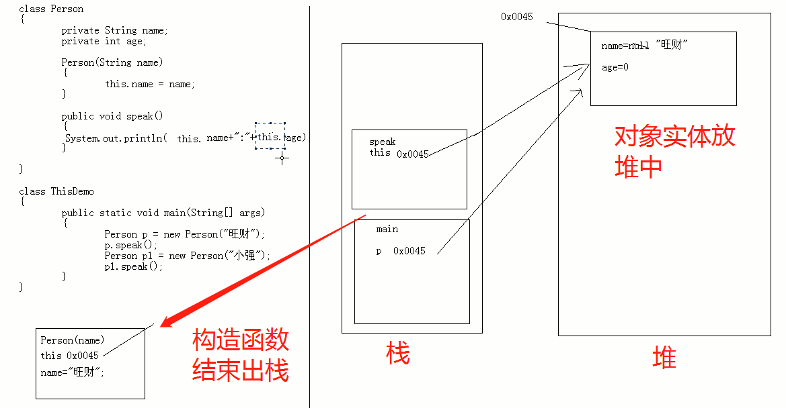
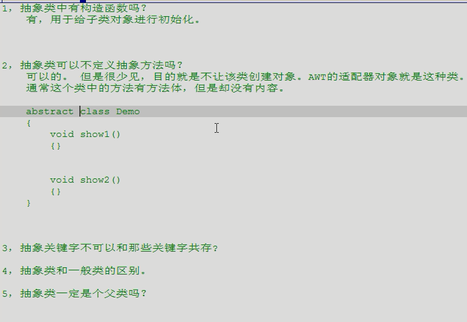
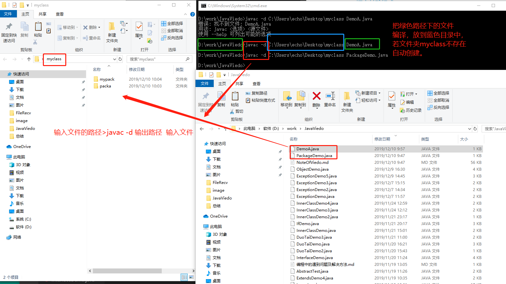
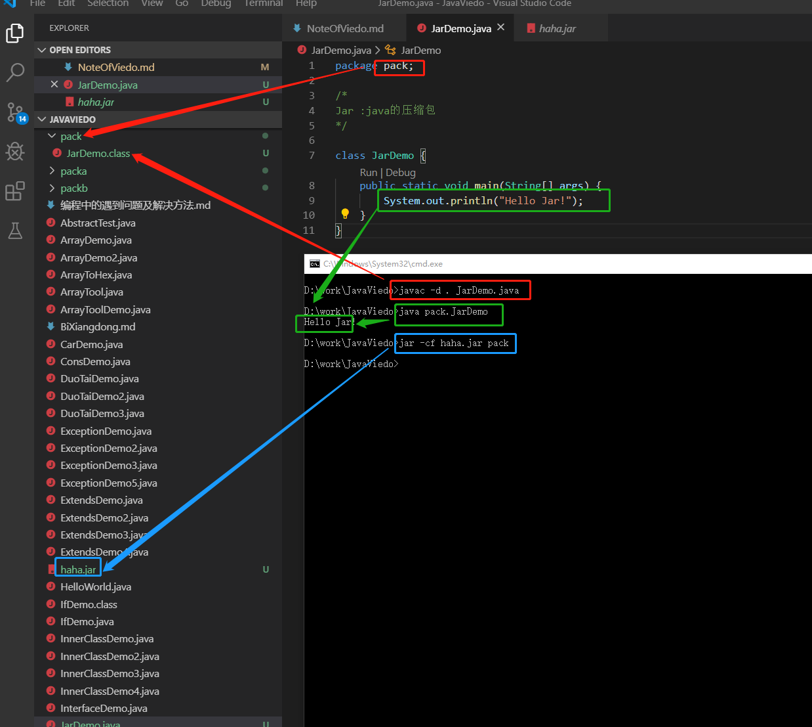

<!-- @import "[TOC]" {cmd="toc" depthFrom=1 depthTo=6 orderedList=false} -->

<!-- code_chunk_output -->

- [一、Java语言概述（SE01）](#一-java语言概述se01)
  - [1.1 java语言的三种技术架](#11-java语言的三种技术架)
  - [1.2 java语言的跨平台原理](#12-java语言的跨平台原理)
  - [1.3 java运行环境JRE,开发环境JDK](#13-java运行环境jre开发环境jdk)
  - [1.4 JDK的下载与安装](#14-jdk的下载与安装)
  - [1.5 JAVA的GUI、CLI](#15-java的gui-cli)
  - [1.6 命令行命令简介（注意help的应用）](#16-命令行命令简介注意help的应用)
  - [1.7-1.9 Java环境变量配置](#17-19-java环境变量配置)
  - [1.10](#110)
- [二、Java语言基础组成（SE02-SE06）](#二-java语言基础组成se02-se06)
  - [2.1 关键字](#21-关键字)
  - [2.2 标识符](#22-标识符)
  - [2.3 注释](#23-注释)
    - [2.3.1 注释的分类：](#231-注释的分类)
    - [2.3.2 注释的作用：](#232-注释的作用)
    - [2.3.3 注释的模板：](#233-注释的模板)
    - [2.3.4 类型转换（数值型之间）](#234-类型转换数值型之间)
  - [2.4 常量与变量](#24-常量与变量)
  - [2.5 运算符](#25-运算符)
    - [2.5.1 boolean型：](#251-boolean型)
    - [2.5.2 逻辑运算符](#252-逻辑运算符)
    - [2.5.3 双与（&&）双或（||），单与（&）单或（|）](#253-双与双或单与单或)
    - [2.5.4 左移](#254-左移)
    - [2.5.5 右移](#255-右移)
    - [2.5.6 三元运算符](#256-三元运算符)
  - [2.6语句(SE04)](#26语句se04)
  - [2.7函数(SE04)](#27函数se04)
    - [2.7.1 函数重载](#271-函数重载)
    - [2.7.2 函数内存加载](#272-函数内存加载)
  - [2.8数组(SE04-SE05)](#28数组se04-se05)
    - [2.8.1 内存的划分](#281-内存的划分)
    - [2.8.2 数组的应用-进制转换](#282-数组的应用-进制转换)
- [三、面向对象（SE06-SE12）](#三-面向对象se06-se12)
  - [SE06](#se06)
  - [3.1 面向对象概念](#31-面向对象概念)
  - [3.2 类与对象的关系](#32-类与对象的关系)
    - [3.2.1 类与对象](#321-类与对象)
    - [3.2.2 引用变量](#322-引用变量)
    - [3.2.3 栈和堆](#323-栈和堆)
    - [3.2.4 成员变量和局部变量的区别](#324-成员变量和局部变量的区别)
    - [3.2.5 匿名对象](#325-匿名对象)
    - [3.2.6 java参数传递](#326-java参数传递)
  - [3.3 封装](#33-封装)
  - [SE07](#se07)
  - [3.4 构造函数](#34-构造函数)
    - [3.4.1 构造函数小结：](#341-构造函数小结)
  - [3.5 this关键字](#35-this关键字)
    - [3.5.1 this 理解：](#351-this-理解)
    - [3.5.2 this原理、使用场景以及细节](#352-this原理-使用场景以及细节)
    - [3.5.3 this的分类](#353-this的分类)
    - [3.5.2 super的分类](#352-super的分类)
    - [3.5.3 super和this的异同:](#353-super和this的异同)
  - [3.6 static关键字](#36-static关键字)
    - [3.6.1 static关键字作用](#361-static关键字作用)
    - [3.6.2 static特点](#362-static特点)
    - [3.6.3 static变量和成员（实例）变量区别：](#363-static变量和成员实例变量区别)
    - [3.6.4 static修饰成员](#364-static修饰成员)
    - [3.6.5 static使用注意事项](#365-static使用注意事项)
    - [3.6.6 main函数解析](#366-main函数解析)
    - [3.6.6 static内存图解](#366-static内存图解)
  - [3.7 构造代码块](#37-构造代码块)
    - [3.7.1 构造代码块和构造函数区别](#371-构造代码块和构造函数区别)
    - [3.7.2 代码块分类](#372-代码块分类)
  - [SE08 面向对象（数组）](#se08-面向对象数组)
    - [3.8 面向对象](#38-面向对象)
      - [3.8.1 数组工具对象建立](#381-数组工具对象建立)
    - [3.8.2 数据工具类中静态的使用](#382-数据工具类中静态的使用)
    - [3.8.3 java文档注释提取工作javadoc](#383-java文档注释提取工作javadoc)
  - [3.9 设计模式](#39-设计模式)
    - [3.9.1 设计模式概念](#391-设计模式概念)
    - [3.9.2 单例设计模式内存实现](#392-单例设计模式内存实现)
    - [3.9.3 单例设计模式实现的两种模式](#393-单例设计模式实现的两种模式)
  - [3.10 继承](#310-继承)
    - [3.10.1 继承的概述](#3101-继承的概述)
    - [3.10.2 定义继承](#3102-定义继承)
    - [3.10.3 子父类**成员变量**内存图解](#3103-子父类成员变量内存图解)
    - [3.10.4 子父类**成员函数**特点](#3104-子父类成员函数特点)
    - [3.10.5 覆盖的应用](#3105-覆盖的应用)
  - [SE09](#se09)
    - [3.10.6 子父类中的构造函数](#3106-子父类中的构造函数)
  - [3.11 final关键字](#311-final关键字)
  - [3.12 抽象类](#312-抽象类)
  - [3.12 接口](#312-接口)
  - [SE10](#se10)
  - [3.13 多态](#313-多态)
  - [3.14 内部类](#314-内部类)
  - [3.15 匿名类（内部类的简写格式）](#315-匿名类内部类的简写格式)
  - [SE11](#se11)
  - [3.16 异常](#316-异常)

<!-- /code_chunk_output -->


# 一、Java语言概述（SE01）

## 1.1 java语言的三种技术架


## 1.2 java语言的跨平台原理
> 任何系统运行程序都要解析（先读读，读懂再执行。），Windows是用c和c++写的，所以可以解析c和c++写的东西，Java写的程序要在他上面运行，需要用一个解析器-虚拟机（JVM），用来解析成对应平台上可以识别的，虚拟机一方面可以和平台沟通，另一方面可以和java沟通。
虚拟机就是虚拟出一台机器，用于解析程序，解析java的虚拟机叫java虚拟机-JVM，虚拟机不跨平台，必须根据OS装对应的版本，让脏活累活给虚拟机干。


## 1.3 java运行环境JRE,开发环境JDK
> 使用任何语言，要运行的话必须搭建运行环境（JRE:Java Runtime Environment），要开发该语言的软件，还必须有他对应的开发工具包(JDK:Java Development Kit)。
运行Java-------JRE: JVM + 核心类库	        
开发Java-----JDK:JRE+java的开发工具


## 1.4 JDK的下载与安装
> JDK的安装目录拷到U盘也可以用，所以不要装到C盘

## 1.5 JAVA的GUI、CLI
> 图像化界面是将命令行封装后使用鼠标这些操作。

## 1.6 命令行命令简介（注意help的应用）


## 1.7-1.9 Java环境变量配置

> 使得java在其他非安装目录下，用cmd也可以打开，这种情况下可以将java的安装路径放到系统的环境变量下系统变量（系统应用程序的路径）。
这是因为如果当前目录下，没有找到可执行（.exe）程序，那么就会在系统路径下找，如果找不到，就报错。所以为了让系统帮我们找，我们可以事前把Java的bin的路径添加到环境变量的系统变量下。重启cmd,验证。
*	下载JDK并安装
*	配环境变量:
**方法一：在path中直接添加-------风险大**
**方法二：新建环境变量：用变量添加 ----风险小，易修改**
* cmd中验证：javac  -version

## 1.10 
* javac : 对Java编译,javac启动了JDK中的编译程序
* java: 运行java的class，启动虚拟机，到指定的位置，找指定class，加载到内存，找主函数，作为入后，开始执行。


# 二、Java语言基础组成（SE02-SE06）

## 2.1 关键字
* 关键字必须都是小写
* 语言已经定义好的
* 类名最好大写


## 2.2 标识符
* 程序自定义的名称
* 字母，0-9，_,& 组成
* 合法话的规则：
    * 1.数字不可以开头
    * 2.不可以使用关键字
* java严格区分大小写
* 要命名有意义

## 2.3 注释
### 2.3.1 注释的分类：
* 单行注释： // 
* 多行注释：/* */
* 文档注释：/** 该部分文档可以用工具javadoc.java提取 */

### 2.3.2 注释的作用：
* 注释用于代码作用的阐述，代码是思想的体现
* 用于测试，排除bug的位置

### 2.3.3 注释的模板：
* 先写多行注释
* 需求、思路、步骤
### 2.3.4 类型转换（数值型之间）
* 隐式类型转换（把小的放到大的中）
* 显示类型转换（把大的放到小的中）
```java
/* 多行注释

需求：练习一个hello world程序

思路：
1. 定义一个类
2. 定义一个主函数
3. 因为要演示，故还要输出语句

步骤：
1. 用class关键字完成类的定义，并起有意义的变量名
2. 主函数：public
3. 使用输出语句：System.out.println("Hello world");
*/
class Demo 
{
    // 定义一个主函数，保证程序的独立运行
    public static void main(String[] args)
    {
        System.out.println("Hello world"); // 打印字符串到控制台上
    } 
}
```

## 2.4 常量与变量


## 2.5 运算符


### 2.5.1 boolean型：
* 比较运算符运算完肯定有结果,是boolean型： True,False。

### 2.5.2 逻辑运算符
* 常用于连接连接两个boolean型表达式。
* 逻辑运算符的**单与、单或、异或**也可以作为位运算符，运算前将两侧的数字先 变为二进制
* A异或（位运算）B两次，结果还是A，用于加密

### 2.5.3 双与（&&）双或（||），单与（&）单或（|）
* 双与（&&）双或（||）有短路的效果，最终运算结果和单与单或一样，但是双与双或在前面可以推出结果，后面就不算了，更加高效。
### 2.5.4 左移
* A左移B位就是A = Ax(2^B)

### 2.5.5 右移
* A右移B位就是A = A\\(2^B)
* 无符号右移">>>"：高位用0补
* 有符号右移">>"：高位用原来高位数字补

### 2.5.6 三元运算符
* 找两个数的较大的存下来,是if-else的简写格式

## 2.6语句(SE04)


> **局部代码块**
  里面的变量在括号外面就已经释放了，是局部变量，可以节省内存空间。

## 2.7函数(SE04)
### 2.7.1 函数重载
### 2.7.2 函数内存加载


## 2.8数组(SE04-SE05)


### 2.8.1 内存的划分
* 寄存器
* 本地方法区
* 方法区
* 栈内存
    * 存储都都是局部变量（作用域内有效，随时释放）
* 堆内存
    * 存储实体，都是数组和对象
    * 数组就是对象，凡是new就在堆里面
    * 每一个实体都有首地址
    * 堆内存中每个变量都有默认始化值，类型不同，初始化都值不同
    * 堆有垃圾回收机制

### 2.8.2 数组的应用-进制转换

> **思路**：
>* java中int是4个字节，8*4共32bit，在电脑中用二进制存储
>* 二进制是用8位表示1位十进制数
>* 十六进制用4位表示一位
>* 所以将二进制4位4位划分，并将结果与15进行位与，就是该位置对应的十六进制的值（java中int最多转化的十六进制有8位）。

>**难点：**
>* **二进制与十六进制从10开始数字和字符对应关系：**
十六进制：1，2，3，4，5，6，7，8，9，A,B,C,D,E,F
 二进制： 1，2，3，4，5，6，7，8，9，10,11,12,13,14,15
>* **方法一**：用10作为基准，通过ASCII码+强制类型转换
>* **方法二（查表法）**：通过利用数组，将元素存在数组中，利用角标天然对应关系
 
>**倒序输出转化结果**
 将每四位转换一个的结果存在栈（可以存不同类型的元素）中，等转换结束后，再依次出栈。
 


``` java 
// 2进制转16进制
import java.util.Stack;

class ArrayToHex
{
    public static void main(String[] args) {
        int num = 60;
        toHexInASCII(num);
        toHexInTable(num);
    }

    public static void toHexInASCII(int num)
    {// 方法一：用ASCII编码 + 栈存结果
        System.out.println("The num " + num + " transfer to Hex using ASCII is :" ); 
        int temp = 0;
        char numHex;
        Stack result = new Stack();
        //System.out.println("\n The result of push:");
        for(int i=0;i<8;i++){
            while(num != 0){
                temp = num & 15;
                if (temp>9){
                    numHex = (char)(temp - 10 + 'A');
                    //System.out.print("\t" + numHex);
                    result.push(numHex);
                }
                else {
                    //System.out.print("\t" + temp);
                    result.push(temp);
                }
                //System.out.print(numHex);
                num = num >>> 4;                
            }
        }
        //System.out.println("\n\n The result of pop:");
        
        while(!result.empty()){
           
            System.out.print( result.peek());
            result.pop(); // 一定要出栈，否则死循环
            //char a =(char) result.pop();
            //System.out.print("\t" + a);
        }
    }// end toHexInASCII

    public static void toHexInTable (int num) {
        //方法二：用查表法算2进制到16进制 + 数组存结果
        System.out.println("\n The num " + num + " transfer to Hex using Table is :" ); 
        char[] table = {'1','2','3','4','5','6',
                        '7','8','9','A','B','C',
                        'D','E','F'};
        char[] result = new char[8];
        int pos = 0;
        for(int x=0; x<8; x++){
            while (num != 0){
                int temp = num & 15;
                result[pos++] = table[temp-1]; 
                num = num>>>4;
            }
        }
        //System.out.println("\n result2"); 
        for (int x=(result.length-1); x>=0;x--){
            // 倒序打印数组元素
            System.out.print(result[x]);
        }
    }
}
```
# 三、面向对象（SE06-SE12）


## SE06
## 3.1 面向对象概念
>* **面向对象与面向过程**
>
>* 面向过程：强调动作,如C
>* 面向对象：强调实体,如C++,C#,Java

## 3.2 类与对象的关系
### 3.2.1 类与对象
> * 类：事物的描述，包括属性和行为
> 月饼模具
> * 对象：事物的实体，通过**new**创建
> 月饼
> 

### 3.2.2 引用变量
https://www.jianshu.com/p/0efa04ea1f97
> * 类的对象
> * 数组

### 3.2.3 栈和堆


### 3.2.4 成员变量和局部变量的区别


### 3.2.5 匿名对象


### 3.2.6 java参数传递
> java 对象存在堆中，new一个对象，在堆中新开一块区域
> java 函数存在栈中


## 3.3 封装
> 1、封装为了隐藏实现细节，保证安全性，同时使得操作可控。
> 
> 2、类的属性（age为例）一般要-setage(); getage();
> 3、私有可以封装，但是封装还有其他实现方法，不只有私有，如函数、类、框架。
> 4、private:
> 

## SE07 
## 3.4 构造函数

### 3.4.1 构造函数小结：
> **1、特点：** 无返回值，函数名同类名，给对象初始化，只用一次，所以要修改属性XX的话，要用setXX(),getXX().
> 
> **2、默认情况：** 一个类如果没有定义构造函数，那么类中会有一个默认构造函数，如果定义了，就用定义的。对象一定要初始化才能用！
>  
> **3、 一般函数和构造函数的区别**：
>  **构造函数**：对象创建时，就会调用，且只调用一次。
>  **一般函数：**对象创建后，需要时才调用
> 
> **4、 构造函数的使用场合：**
> 对象在一创建时就有某些属性时，可以放在构造函数中
> 
> **5、构造函数重载：**
>  同一个类中可以定义多种构造函数的实现形式，即重载
```java
class ConsDemo{
    public static void main(String [] args){
        // 定义一个对象就调用构造函数
        Person p1 = new Person();
        p1.speak(); 
        // 
        Person p2 = new Person("wc");
        p2.speak(); // 
        Person p3 = new Person(5);
        p3.speak(); // 
        Person p4 = new Person("wc",5);
        p4.speak(); // 
        Person p5 = new Person(5,"wc");
        p5.speak(); // 
    }
}
class Person{
    private String name;
    private int age;
    // 定义构造函数
    // (可同时定义多个构造函数)
    // 即重载
    Person(){
        name = "baby";
        age = 1;
        System.out.println("\nperson1 run");
    }
    Person(String n){
        name = n;
        System.out.println("\nperson2 run");
    }
    Person(int a){
        age = a;
        System.out.println("\nperson3 run");
    }
    Person(String n,int a){
        name = n;
        age = a;
        System.out.println("\nperson4 run");
    }
    Person(int a,String n){
        name = n;
        age = a;
        System.out.println("\nperson5 run");
    }
    // 定义一般函数
    public void speak(){
        System.out.println(name + ":" + age);
    }
}
```
> **6、构造函数-内存图解：**
> 主函数必须入栈
> 构造函数在栈中完成任务之后就出栈
> 对象在堆中：先用构造函数在栈中对在堆中的对象实例初始化，完成后构造函数出栈
> 

## 3.5 this关键字
### 3.5.1 this 理解：
> this是当前对象，代表对象本身，可以理解为：所在函数的所指对象的一个引用
> 局部变量 和 成员变量冲突了,可以用this区分,如下：
```java
    Person(String name, int age){
       // name     = name;
       // 局部变量 和 成员变量冲突了,用this区分
        this.name = name;
        this.age = age;
        System.out.println("person run2"); 
    }
```
### 3.5.2 this原理、使用场景以及细节
> * 构造函数，一般函数进栈都默认含了this
> 
> * 用this作为对象，嵌套使用构造函数，要遵循别人的先执行，自己的后执行，
> 最终结果要是自己构造函数初始化设置的值。
> 
> 

### 3.5.3 this的分类
> * **1、普通的直接引用**
> 这种就不用讲了，this相当于是指向当前对象本身。
> * **2、引用构造函数**
> 这个和super放在一起总结，见下面。
> * **3、形参与成员名字重名，用this来区分：**
```java 
class Person {
    private int age = 10;
    public Person(){
    System.out.println("初始化年龄："+age);
}
    public int GetAge(int age){
        this.age = age;
        return this.age;
    }
}
 
public class test1 {
    public static void main(String[] args) {
        Person Harry = new Person();
        System.out.println("Harry's age is "+Harry.GetAge(12));
    }
}    
```
### 3.5.2 super的分类
> super可以理解为是指向自己超（父）类对象的一个指针，而这个超类指的是离自己最近的一个父类。
> * **1、普通的直接引用**
> 与this类似，super相当于是指向当前对象的父类，这样就可以用super.xxx来引用父类的成员。
> * **2、引用构造函数**
> super（参数）：调用父类中的某一个构造函数（应该为构造函数中的第一条语句）。
> this（参数）：调用本类中另一种形式的构造函数（应该为构造函数中的第一条语句）。
> * **3、子类中的成员变量或方法与父类中的成员变量或方法同名**

### 3.5.3 super和this的异同:
> * super（参数）：调用基类中的某一个构造函数（应该为构造函数中的第一条语句） 
> * this（参数）：调用本类中另一种形成的构造函数（应该为构造函数中的第一条语句）
> * super:　它引用当前对象的直接父类中的成员（用来访问直接父类中被隐藏的父类中成员数据或函数，基类与派生类中有相同成员定义时如：super.变量名    super.成员函数据名（实参）
> * this：它代表当前对象名（在程序中易产生二义性之处，应使用this来指明当前对象；如果函数的形参与类中的成员数据同名，这时需用this来指明成员变量名）
> * 调用super()必须写在子类构造方法的第一行，否则编译不通过。每个子类构造方法的第一条语句，都是隐含地调用super()，如果父类没有这种形式的构造函数，那么在编译的时候就会报错。
> * super()和this()类似,区别是，super()从子类中调用父类的构造方法，this()在同一类内调用其它方法。
> * super()和this()均需放在构造方法内第一行。
尽管可以用this调用一个构造器，但却不能调用两个。
> * this和super不能同时出现在一个构造函数里面，因为this必然会调用其它的构造函数，其它的构造函数必然也会有super语句的存在，所以在同一个构造函数里面有相同的语句，就失去了语句的意义，编译器也不会通过。
> * this()和super()都指的是对象，所以，均不可以在static环境中使用。包括：static变量,static方法，static语句块。
> * 从本质上讲，this是一个指向本对象的指针, 然而super是一个Java关键字。

## 3.6 static关键字

### 3.6.1 static关键字作用
> static的主要作用在于创建独立于具体对象的域变量或者方法,比如对象是中国人，则国籍大家都一样，所以存一个就可以了，这个时候用static,即所有对象都共享这个属性，在对象之前定义 。
> 
> static不要滥用：教室中每个人都有一个饮水机：滥用

### 3.6.2 static特点
> * static是一个修饰符，修饰成员（属性、方法）
> * static变量：static修饰的成员为所有对象共有,存于类初始化时
>   成员变量：（普通的对象变量自己所有，存在于对象中）
> * static修饰的成员一般放在类初始化的时候，所以优先于对象存在
> * static修饰的成员，类名和对象都可以调用：
>   类名.静态成员---------> Person.country

### 3.6.3 static变量和成员（实例）变量区别：
> * **1、两个变量的生命周期不同**
>  成员变量：随着对象的创建而创建，对象的消失而消失。
>  static变量：随着类的加载而创建，随着类的消失（JVM）消失而消失。
>  综上：成员变量生命周期短，但是占用空间大（重复定义），成员变量生命周期长，但是占用空间小。
> * **2、调用方式不同**
> * 成员变量只能对象调用
> * static变量既可以通过类名也可以通过对象调用
> * **3、别名不同**
> * 成员变量：实体变量
> * static变量：类变量
> * **4、存储位置不同**
> * 成员变量存在堆（全是实体）内存，即对象特有属性
> * static变量存在：方法（共享数据）区
>     不在堆：因为堆中都是实体
>     不在栈：栈生命周期短，随函数加载而存在，释放而消失


### 3.6.4 static修饰成员
> * 修饰成员变量
> * 修饰成员方法
> * 静态块
> * 静态导包

### 3.6.5 static使用注意事项
> * static方法只能访问静态成员（变量、函数（方法））
> * 非static方法既可以访问static成员又可以访问static成员。
> * static方法中不可以使用this（当前对象）或者super，因为static方法没有传入对象
> * 主函数是static

### 3.6.6 main函数解析

> * 主函数格式固定 
> * 被JVM调用


### 3.6.6 static内存图解


## 3.7 构造代码块
### 3.7.1 构造代码块和构造函数区别
> 构造代码块：给所有的对象初始化
> 构造函数：给指定的对象初始化 

### 3.7.2 代码块分类
> * **静态代码块：**
> 类中static修饰的代码块
> 作用：用于类（全是静态）的初始化
> （有些类，没有对象，所以不能用构造函数初始化）
> * 什么时候执行：类加载的时候执行，且执行一次
> 
> * **构造代码块**
> * 构造代码块：类中{}内的代码块
> * 什么时候执行：创建对象的时候执行，创建一次对象就执行一次，且先于构造函数执行
> 
> * **局部代码块**
> * 局部代码块：方法中{}内的代码块
> * 作用：用于限定局部变量的生存范围，节省内存空间
> * 什么时候执行：方法中顺序执行

## SE08 面向对象（数组）
### 3.8 面向对象 
#### 3.8.1 数组工具对象建立
> * ArrayToolDemo中main中放对象定义，方法调用
> * 方法实现封装起来，放到一个新的类ArrayTool（无main）
> * ArrayTool方法修饰符：访问不到成员(对象的特有数据)变量，用static修饰
> * ArrayTool类中方法都是静态，所以该类不需要创建对象，为了保证不让其他成创建该类对象，可以将构造函数私有化 

### 3.8.2 数据工具类中静态的使用

### 3.8.3 java文档注释提取工作javadoc
> * 使用javadoc文档化的类必须是public类型的

## 3.9 设计模式
### 3.9.1 设计模式概念
**设计模式**
> * 对问题行之有效的解决方式，其实是一种思想，对面向对象语言中出现问题的解决方法。
> * java有23种设计模式，单例设计模式是其中一种。

**单例设计模式**
> **解决的问题** :保证一个类在内存中的对象唯一性。
> **思想：**
>  * 1、不允许其他程序用new创建该类对象
>  * 2、在该类创建一个本类实例
>  * 3、对外提供一个方法让其他程序获得该对象
> **步骤**
> * 1、构造函数私有化（private）
> * 2、Single s = new Single();
> * 3、定义一个公有方法，将创建的对象返回。
```java 
/**
 * 单例设计模式 1、保证一个类在内存中的对象唯一性
 */
class Single {
    // 创建本类对象
    static Single s = new Single();

    // 私有化构造函数
    private Single() {
    };

    // 定义外部调用的方法，返回本类对象
    // 目的：使得成员函数可控
    public static Single getInstance() {
        return s;
    }
}


class SingleDemo {
    public static void main(String[] args) {
        // 因为构造函数不可用，所以用类名调用（设为static）

        Single s1 = Single.getInstance(); // 指向对象s
        Single s2 = Single.getInstance(); // 指向对象s
        System.out.println(s1 == s2);   // ture

        Test t1 = new Test();
        Test t2 = new Test();
        t1.setNum(10);
        t2.setNum(20);
        System.out.println(t1.getNum());
        System.out.println(t2.getNum());
        
        // 改装后的单例设计模式TestII类
        TestII tt1 = TestII.getInstance();
        TestII tt2 = TestII.getInstance();
        tt1.setNum(10);
        tt2.setNum(20);
        System.out.println(tt1.getNum());
        System.out.println(tt2.getNum());

    }
}

class Test{
    // 每个对象在内存中都有自己的位置
    private int num;

    public void setNum(int num){
        this.num = num;
    }
    public int getNum(){
        return num;
    }    
}

class TestII{
    // 每个对象在内存中都有自己的位置
    static TestII t = new TestII();
    private int num;
    private TestII(){};
    
    public static TestII getInstance(){
        return t;
    }


    public void setNum(int num){
        this.num = num;
    }
    public int getNum(){
        return num;
    }    
}

```


### 3.9.2 单例设计模式内存实现


### 3.9.3 单例设计模式实现的两种模式
> * 饿汉式：一开始就建好自己的对象
> * 懒汉式：需要的时候再建自己的对象


## 3.10 继承

### 3.10.1 继承的概述
> * **继承的好处：**
> * 1、提高了代码复用性
> * 2、类与类之间发生了关系，为多态的出现提供了前提。

> * **单继承、多继承**
> * 单继承：一个子类只能有一个直接父类
> * 多继承：一个子类可以有多个直接父类
> * java只支持单继承不支持多继承，因为如果当多个父类中有     同一个方法的时候，该子类调用时回出现矛盾。
> * java不允许多继承，但是对其进行了改良。
> * java支持多层（多重继承）：A->B->C->D
> * 当要使用一个继承体系时：
> * 1、查看该体系中的顶层类，了解该体系的基本功能
> * 2、创建体系中的最子类对象，完成功能的使用
 
### 3.10.2 定义继承
> * **何时继承：**
>   类与类之间存在所属关系，就定义继承
>   xxx 是yyy的一种：xxx extends yyy

> * **继承概念图**


> * **子父类中成员变量的特点**
> *  super和this的异同:
> * super:当父类和子类成员同名时用super区分
> * this: 当本类成员和局部变量同名时用this区分
> * this: 代表一个本类对象的引用
> * super：代表一个父类空间

### 3.10.3 子父类**成员变量**内存图解

> * 子类把父类的所有成员变量，在建立子类对象时，都重新存了
> * 子类不能直接访问父类中private成员，但是可以通过定义方法，从而访问父类私有成员。

### 3.10.4 子父类**成员函数**特点
> * 子父类成员函数不同名：先找子类再找父类
> 
> * 子父类成员函数同名且一模一样(函数声明一模一样)：运行子类（覆盖父类）
> 
> * **子类覆盖父类的注意事项：**
> >* 子类的权限必须大于父类的权限（private,public,默认啥都不写）才能覆盖父类的成员函数。
> >* 静态只能覆盖静态，或被静态覆盖。

> * **函数的两个特性**
> > * 重载：同一个类中：overload
> > * 覆盖：子类中，覆盖也称为重写，覆写。override
> 
> * **父子类成员函数不同名**
> 
> 
> **父类子类函数同名**
> 


### 3.10.5 覆盖的应用
> 当对一个类进行子类的扩展时，子类需要保留父类的功能声明，但是定义子类中该功能的特有内容时，就使用覆盖操作完成。
```java 
class ExtendsDemo3{
    public static void main(String[] args) {
        Phone p1 = new Phone();
        System.out.println("\nPhone:");
        p1.show();

        NewPhone p2 = new NewPhone();
        System.out.println("\nNewPhone:");
        p2.show();
    }
}
class Phone{
    void call() {}

    void show(){
        System.out.println("number");
    }
}
class NewPhone extends Phone { 
    void show(){
        super.show();// 保留父类中show原有方法
        System.out.println("picture");
        System.out.println("name");
    }
}
```
## SE09
### 3.10.6 子父类中的构造函数
> * **特点：**
> * 1、子类构造对象时，访问子类的构造函数，父类构造函数也运行了，这是因为子类中第一行默认有一个隐式语句：super()
> * 2、子类的实例化过程：子类中所有的构造函数默认都会访问父类中的空参数的构造函数。
> * 3、为什么子类实例化要访问父类构造函数？
>   因为子类继承父类，获取父类的内容，所以在使用父类内容之前，子类在构造对象时，必须访问父类中的构造函数。为了完成这个动作，就在子类的构造函数中加入了super()语句。子类实例化，必须访问父类构造函数，通过super().
>  如果父类中没有定义空参数构造函数，那么子类的构造函数必须用super明确调用父类的那个构造函数,同时，子类用this调用本类构造函数时，super（）就没有了，因为super和this只能定义第一行，所以只能有一个，但是可以保证的是，子类中肯定会有其它构造函数调用父类的构造函数。
> * 4、super语句中必须定义在子类构造函数的第一行，因为父类的初始化动作要先完成。
> * 5、子类实例化顺序：
> 默认初始化---》super初始化----》this初始化
> 
> 

## 3.11 final关键字
> * final：为了保护因为继承而破坏的封装性


## 3.12 抽象类
> * **概述**
> * 抽象类：笼统、模糊、看不懂、不具体。

> * **特点**


> * **细节**


> * 3、抽象关键字不可以和那些关键字共存？
> > private：不让别人访问
> > static：不让所修饰的类有对象
> > final: 不让所修饰的类继承

> * 4、抽象类和一般类异同点：
> > 相同点：
>   抽象类和一般类都是用来描述事物的，都在内部定了成员
> > 不同点：
>   （1）、一般类有足够信息描述事物，抽象类只包含基本信息。
>   （2）、一般类中不能定义抽象方法，只能定非抽象方法
>   （3）、一般类可以被实例化，抽象类不可以实例。

> * 5、抽象类一定是一个父类吗？
> 是的，因为子类覆盖其方法后，才可以定义方法。

> * **抽象类的使用原则**
> * 抽象方法必须为public或者protected（因为如果为private，则不能被子类继承，子类便无法实现该方法），缺省情况下默认为public；
> * 抽象类不能直接实例化，需要依靠子类采用向上转型的方式处理；
> * 抽象类必须有子类，使用extends继承，一个子类只能继承一个抽象类；
> * 子类（如果不是抽象类）则必须覆写抽象类之中的全部抽象方法（如果子类没有实现父类的抽象方法，则必须将子类也定义为为abstract类。）；
```java
abstract class Employee {
    private String name;
    private double pay;
    // 可以通过实例化对象调用
    public String id;

    Employee(String name, String id, double pay) {
        this.name = name;
        this.id = id;
        this.pay = pay;
    }

    public String getName() {
        return this.name;
    }

    // 抽象方法，没有方法体，有abstract关键字做修饰
    abstract public void work();
}

class Manager extends Employee {
    // 额外的属性
    private int age;
    private int bonus;

    Manager(String name, String id, double pay, int age, int bonus) {
        super(name, id, pay);
        this.age = age;
        this.bonus = bonus;
    }

    public void work() {
        System.out.println("manage...");
    }
}

class AbstractTest {
    public static void main(String[] args) {
        Manager m = new Manager("Enzo", "10", 50000, 26, 2332);
        // 抽象类的子类实例化对象，赋值给抽象类
        Employee e = new Manager("Echo", "3", 1000, 26, 45);
        // 父类抽象方法的调用
        m.work();
        // 父类普通方法的调用
        System.out.println(m.getName());

        System.out.println(e.getName());
        // Employee中public的属性、方法，均可以通过对象实例调用
        System.out.println(e.id);
    }
}

```
## 3.12 接口

> 当抽象类中的方法都是抽象的时候，就可以吧该抽象类用另一种方式表示，就是接口：interface
> **接口特点：**
> * 成员有特定的修饰符(可以省略，但最好保留)：
> > 全局变量：public static final
> > 抽象方法：public abstract

> **继承与实现的区别：**
> * 继承：类与类之间是继承，有写写好了，有些没写要重新写
> * 实现：类与接口之间是实现，所有的方法都是空壳，要重新写

> **不可以直接实例化的类：**
> * 接口是特殊的抽象类：接口中的所有方法都是抽象方法
> *接口不可以实例化，只能由接口的子类覆盖了接口中所有的抽象方法后，该子类才能实例化
> * 抽象类不可以实例化
> * 普通父类可以实例化 

> **接口的用法：**
> * 1、实现了java中的多继承机制
> >java中不支持多继承，因为会出现调用的不确定性，所以Java中通过多实现（多个接口），实现了多继承的机制。即一个类可以实现多个接口。
> > ```java
> > class TestMulitImplement implements A,B
> > ```
> * 2、一个类继承（extends）另一个类，同时实现(implements)多个接口
> > ```java
> > class TestMulitImplement2 extends Q implements A,B
> > 
> * 3、接口与接口之间是继承
> > ```java
> > interface TestMulitImplement3 extends CC,MM
> > 

> * **接口特点**
> 

> * **接口和抽象类的区别**
> 
> 

## SE10
## 3.13 多态

> **多态的概述**
> > * 对象的多态：猫即是猫（子类）也是动物（父类），父类的对象指向子类创建的对象。
> > * 简单的说多态就是一个对象对应不同的类型
> > * 多态在代码中的体现：父类或者接口的引用指向子类对象

> **多态的好处**
> > * 提高代码扩展性，前期定义的代码可以使用后期的内容
>   Animal a,所有的a都可以eat

> **多态的弊端**
> > * 前期定义的内容不能使用（调用）后期调用的新方法

> **多态的前提**
> > * 子父类的关系：所以可以用父类指向子类对象，用于实现多个对象时的某些方法

> **多态-转型**
> > * 父类指向子类对象：
>   自动类型提升，这样的目的：限制对特有功能的访问。
> 
> > * 将“假”父类还原为“原始子类”：
>   向下转型，这样的目的：使用子类中的特有方法。
> 
> **注意：** 
> * 如果父类不是由子类对象转化而来，或者向下转型转为非类型提升前的子类，则会发生异常：ClassCastException.
> * 通常向下转型前先判断一下，提高程序的健壮性。

> **多态-成员及成员函数**
> * 成员及非静态成员函数
> 非静态成员函数通过对象调用

> 
> * 静态成员函数
> 
> 
> 静态函数通过类名或者对象调用都可以，但是最好通过类名调用
> 所以，多态向上转型的时候，调用方法时，以类名调用为主，若以对象调用，就看这个对象在等号左边的类是哪个类，就用哪个类的方法。

## 3.14 内部类


> * **内部类特点**
> * 一般用于类的设计
> * 内部类访问自己外部类中的所以成员
> * 因为外部类要访问内部类，所以必须建立内部类的对象
> 

> * **内部类的修饰符**
> * static: 
> 内部类是静态的，等价于一个外部类
> 内部类中有static方法，则该内部类必须是static
```java
class Outer2{
    int num = 3;
    class Inner2{
        int num = 4;
        void show2(){
            int num = 5;
            System.out.println("num:" + num);// 5
            System.out.println("this.num:" + this.num);//4
            System.out.println("Inner2.this.num:" + Inner2.this.num);//4
            System.out.println("Outer2.this.num:" + Outer2.this.num);//3
        }
    }
    void method2(){
        // Inner2 t = new Inner2();
        // t.show2();
        // 简写为：
        new Inner2().show2(); 
    }
}
class InnerClassDemo2{
    public static void main(String[] args) {
        new Outer2().method2();
    }
}
```

> * **内部类的细节**


> * **内部类-局部类**


## 3.15 匿名类（内部类的简写格式）
> * 匿名类：匿名子类对象-带方法实现的对象。
> * 匿名对象：对象的简写
> 前提：有父类
> 
> 
> 
> 

```java
// 内部类与匿名类
class InnerClassDemo4 {
    public static void main(String[] args) {
        // ==== 内部类的使用
        Outer4 t1 = new Outer4();
        t1.method1();

        // ==== 匿名类的使用

        // 法一、通过外部类的对象调用方法实现
        t1.method2();

        // 法二、通过传入接口实例化对象，直接实现接口方法
        show(new Inter4() {
            public void show1() {
                System.out.println("\n\nNimingClass show1 in main");
            }

            public void show2() {
                System.out.println("NimingClass show2 in main");
            }
        });

    }

    public static void show(Inter4 in) {
        in.show1();
        in.show2();
    }

}

interface Inter4 {
    void show1();
    void show2();
}

class Outer4 {
    // ==== 一、内部类实现接口
    class Inner4 implements Inter4 {
        public void show1() {
            System.out.println("\n\nInner4Class show1");
        }

        public void show2() {
            System.out.println("Inner4Class show2");
        }
    }

    public void method1() {
        // 内部类
        Inner4 in1 = new Inner4();
        in1.show1();
        in1.show2();
    }
    // ==== 二、 匿名类
    public void method2() {
        Inter4 in2 = new Inter4() {
            public void show1() {
                System.out.println("\n\nNimingClss show1");
            }
            public void show2() {
                System.out.println("NimingClss show2");
            }
        };
        in2.show1();
        in2.show2();
    }

}
```

**对象的初始化过程**


## SE11

## 3.16 异常
 

**异常概述：**
> * 为了处理程序中的不正确的代码

**JAVA异常处理：**
> * 将问题处理的部分，和问题出现的地方分开，突出代码的主要流程
> * 突出程序可读性。这是通过异常类实现。

**JAVA异常类**
> * java通过面向对象的思想将问题封装为对象，不同的问题用不同的类描述
>   如：角标越界，空指针等等。将这些问题的共性向上抽取，形成异常体系。
>   最终问题分为两类：

**Throwable:可以抛出的问题，包括Exception,Error**
> * 1、 可处理：Exception
> * 2、 不可处理：Error

**异常的分类：**
> * **编译时被检测异常**
    只要是Exception和其子类都是，除了特殊子类RuntimeException体系
>   这种问题一旦出现，希望编译时就检测，处理，使得问题解决。
> * **编译时不检测异常（运行时异常）**
    就是Exception中的RuntimeException和子类。
>   这种问题使得功能无法继续，运算无法进行，更多时因为调用者的原因导致或引发的异常，一般不处理直接编译通过，运行时，让程序强制停止,使得调用者修改程序，如在求数组角标时，调用者传入空数组，此时停掉程序。

**Java可抛性的体现(被下面关键字修饰的对象和类)：**
> throws: 出现在函数声明中，说明函数可能抛出的自定义的异常们
> throw: 函数内部，执行抛出的这一具体动作

> **异常处理的捕捉形式：**
> 对异常进行针对性处理的方式
> 对能处理的异常：try
> 对不能处理的异常：throws

**一个try多个catch**


> **异常处理的原则：**
> 


**try的格式**
```java
try{
    // 需要被检测异常的代码
}
catch(异常类 变量){
    // 处理异常的代码
}
finally{
    // 一定会被执行的代码
}
```

**finally的格式**
> 必须执行的部分，充当关门：关闭数据库的角色。


**异常停止程序运行**


```java
// java 异常处理与其他语言处理方式对比
class ExceptionDemo
{
    public static void main(String[] args) {
        int [] arr = new int[3];
        /*
        System.out.println(arr[3]);
        // Exception in thread "main" 
        // java.lang.ArrayIndexOutOfBoundsException: 
        // Index 3 out of bounds for length 3 
        // at ExceptionDemo.main(ExceptionDemo.java:5)
        */
        sleep(5);
        
    }
    public static void sleep(int time){

        // 其他语言的处理方式：处理问题和发现问题在一起
        if(time < 0){
            //问题处理
            //问题处理
            //问题处理
        }
        if(time >10000){
            //问题处理
            //问题处理
            //问题处理
        }

        // java的处理异常的方式：通过类与对象
        if(time < 0){
            new FuTime();  // 抛出异常
        }
        if(time >10000){
            new BigTime(); // 抛出异常
        }

        System.out.println("I am sleep about" + time + "hours");
    }
}

class FuTime{}
class BigTime{}
```

**Java自定义异常与API异常使用演示**
自定义异常时，要么继承Exception,要么继承RuntimeException
```java
// 自定义抛出异常与JVM抛出异常演示

class Demo{
    public int method(int[] arr, int index) throws FuShuException{
        // 数组为空的异常
        if (arr == null){
            throw new NullPointerException("数组不能为空");
        }
        // 数组角标越界异常
        if (index >= arr.length){
            throw new ArrayIndexOutOfBoundsException("my Exception:"+index);
        }
        // 数组角标为负数的异常
        // if (index <0){
        //     throw new ArrayIndexOutOfBoundsException("my Exception:"+index);
        // }
        
        // 自定义负数角标异常
        if (index < 0){
            //throw new FuShuException("角标为负数啦");
            throw new FuShuException();
        }

        return arr[index];
    }
}

class FuShuException extends Exception{
    /**
     *  自定义异常
     */
    // 编译器自己加的一句
    private static final long serialVersionUID = 1L;//

    FuShuException() {
    }
    FuShuException(String msg) {
        super(msg);
    }
}

class ExceptionDemo2{
    public static void main(String[] args) throws FuShuException {
        int [] arr = new int[3];
        Demo d = new Demo();

        // int num = d.method(arr, 2);
        // System.out.println("num = " + num + "\n over");

        // int num2 = d.method(null, 2);
        // System.out.println("num = " + num2 + "\n over");

        int num = d.method(arr, -20);
        System.out.println("num = " + num + "\nover");

    }
}
```
**异常的应用与异常转换**
 ```java
// 异常的应用

/* 毕老师用电脑上课
	对象： 毕老师
			电脑
	问题：
		电脑蓝屏：可以处理
		电脑冒烟：不可以处理
	异常转换:MaoYanException到NoPlanException
		MaoYanException: computer is 冒烟.
		大家练习.
		NoPlanException: 课时进度无法完成
		换人!	

	异常转换(封装):
	class NoAddException extends Exception{}

	void addData(Data d) throws NoAddException{
		//连接数据库
		try{
			//添加数据,出现异常:SQLException
		}
		catch(SQLException e){
			//处理代码
			throw new NoAddException(); //异常转换
		}
		finally{
			//关闭数据库
		}
	}
*/
class Comouter{
	private int state = 2; //正常

	public void run() throws LanPingException,MaoYanException{
		// 内部没有处理，要throws一下。
		if (state == 1){// 蓝屏
			throw new LanPingException("computer is 蓝屏.");
		}
		if (state == 2){// 冒烟
			throw new MaoYanException("computer is 冒烟.");
		}
		System.out.println("computer is running.");
	}

	public void reset(){
		this.state = 0;
		System.out.println("电脑重启，state = 0.");
	}
}

class Teacher{
	private String name;
	private Comouter comp;

	Teacher(String name){
		this.name = name;
		comp = new Comouter();
	}

	// public void preLect() throws MaoYanException{//被抛出的异常
	public void preLect() throws NoPlanException{//异常转化
		try {
			comp.run(); // 可能会出现以下2钟异常
			System.out.println( this.name + "在讲课.");			
		} catch (LanPingException e) {
			//这个异常自己可以内部处理的
			comp.reset();
			this.preLect();
		} catch (MaoYanException e) {
			//这个异常自己不能内部处理，要抛出
			System.out.println(e.toString());		
			test(); //大家练习
			//throw e; //这个和公司没关系，无法处理
			throw new NoPlanException("课时进度无法完成." + e.getMessage());
		}
	}

	public void test(){
		System.out.println("大家练习.");		
	}
}

// 异常：
class LanPingException extends Exception{
	LanPingException(String msg){
		super(msg);
	}
} 

class 	MaoYanException extends Exception{
	MaoYanException(String msg){
		super(msg);
	}
} 

class 	NoPlanException extends Exception{
	NoPlanException(String msg){
		super(msg);
	}
} 

class ExceptionDemo5{
	public static void main(String[] args) {
		Teacher t = new Teacher("Bi");
		try {
			t.preLect();
		}//catch(MaoYanException e){
		catch(NoPlanException e){// 异常转换
			System.out.println(e.toString() + "....");
			System.out.println("换人!");
		}
	}
}
```
**异常的注意事项**:


## 3.17 上帝类-Object

```java
/*
	介绍了Object的几个常用方法:
		equals,hashCode,getClass,toString
	通常数据类要覆写下面方法,达到灵活使用对象:
		equals,hashCode,toString
*/
class Fu extends Object {
	Fu() {
		super();
	}
}

class Zi extends Fu {
	Zi() {
		super();
	}
}

class PersonDemo extends Object {
	private int age;

	PersonDemo(int age) {
		this.age = age;
	}

	// 比较对象的年龄=======equals() ================
	// 地址(哈希值)和内容一样
	// public boolean equals(Object obj){//向上转型隐藏子类属性
	// public boolean equals(PersonDemo obj){//或下面再转型
	/*
	 * 一般都要覆盖equals的方法,根据对象的特有内容,建立判断对象是否相等的依据.
	 */
	public boolean equals(Object obj) {
		// 复写Object的equals方法:
		// 原来返回值是比较的是地址是否相等的结果
		// 现在返回值是比较age是否相等的结果
		if (!(obj instanceof PersonDemo)) {
			// return false;
			throw new ClassCastException("类型错误");
		}
		PersonDemo p = (PersonDemo) obj;
		return this.age == p.age && this.hashCode() == p.hashCode();//地址(哈希值)和内容一样才相等
	}

	public int hashCode(){
		return this.age;
	}

	public String toString(){
		return "PersonDemo : " + age;
	}
}

class Demo {
}

class ObjectDemo {
	public static void main(String[] args) {
		Fu f = new Fu();
		Zi z = new Zi();
		Fu f2 = f;
		// ============= equals() =====================
		// 对象直接比较是比较地址
		System.out.println(f == z); // false
		System.out.println(f.equals(z)); // false
		System.out.println(f.equals(f2)); // true

		// 演示复写Object的equals方法
		System.out.println("演示复写Object的equals方法"); // false
		PersonDemo p1 = new PersonDemo(20);
		PersonDemo p2 = new PersonDemo(20);
		PersonDemo p3 = p1;
		System.out.println(p1.equals(p2)); // false
		System.out.println(p1.equals(p3)); // ture
		// 演示复写类型错误抛出异常
		System.out.println("演示复写类型错误抛出异常"); // false
		PersonDemo pp1 = new PersonDemo(20);
		Demo d1 = new Demo();
		Object O1 = new Object();
		// System.out.println(pp1.equals(d1)); // false
		// System.out.println(pp1.equals(O1)); // false

		// ============= hashCode() =====================
		System.out.println("演示hashCode()"); 
		System.out.println(pp1); // 打印hashCode值:PersonDemo@2db0f6b2
		System.out.println(Integer.toHexString(pp1.hashCode())); // 2db0f6b2

		// ============= getClass() =====================
		/*
		getClass是Class类的方法,其中Class是存的所有运行类组成的字节码类.
		*/
		System.out.println("演示getClass()"); 
		System.out.println(pp1.getClass()); // class PersonDemo
		PersonDemo pc1 = new PersonDemo(20);
		PersonDemo pc2 = new PersonDemo(60);
		Class c1 = pc1.getClass();	// 返回的是运行时类的地址
		Class c2 = pc2.getClass();
		System.out.println(c1 == c2); // class PersonDemo

		// ============= toString() =====================
		System.out.println("演示toString()"); 
		System.out.println("pp1:\t" + pp1);
		System.out.println("pp1.toString():\t" + pp1.toString()); //打印hashCode值:PersonDemo@3a4afd8d
		System.out.println("pp1.hashCode():\t" + pp1.hashCode()); //打印hashCode值:PersonDemo@3a4afd8d
		System.out.println("Integer.toHexString(pp1.hashCode()):\t" + Integer.toHexString(pp1.hashCode())); 
	}
}
```
## SE12
## 3.19 包
> 包的特点：
> * 不同内容的类可能重名，此时用包的话就可以对这些类管理。
> * 包通过增加命名空间，区分不同的类。
> * 包名小写
> * 包在文件系统中体现为文件夹，可以手动创建，也可以通过代码创建，可以创建多层包。
> * jar不用解压缩，可以设置路径后直接使用。
```cmd
javac -d .PackageDemo.java  //编译并创建包:mypack
java mypack.PackageDemo //运行
```




