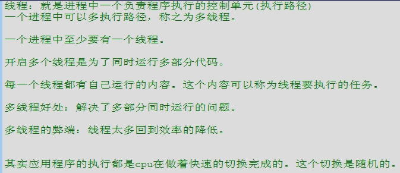

<!-- @import "[TOC]" {cmd="toc" depthFrom=1 depthTo=6 orderedList=false} -->

<!-- code_chunk_output -->

- [四、多线程（SE13-SE14）](#%e5%9b%9b%e5%a4%9a%e7%ba%bf%e7%a8%8bse13-se14)
  - [SE13](#se13)
  - [4.1 多线程概述](#41-%e5%a4%9a%e7%ba%bf%e7%a8%8b%e6%a6%82%e8%bf%b0)
  - [4.2 创建多线程](#42-%e5%88%9b%e5%bb%ba%e5%a4%9a%e7%ba%bf%e7%a8%8b)
- [五、常用对象API(SE15-SE20)](#%e4%ba%94%e5%b8%b8%e7%94%a8%e5%af%b9%e8%b1%a1apise15-se20)
- [六、IO流（SE21-SE24)](#%e5%85%adio%e6%b5%81se21-se24)
- [七、GUI(SE25)](#%e4%b8%83guise25)
- [八、网络编程(SE26)](#%e5%85%ab%e7%bd%91%e7%bb%9c%e7%bc%96%e7%a8%8bse26)

<!-- /code_chunk_output -->

# 四、多线程（SE13-SE14）
## SE13 
## 4.1 多线程概述

## 4.2 创建多线程
**方法一**

# 五、常用对象API(SE15-SE20)

# 六、IO流（SE21-SE24)

# 七、GUI(SE25)

# 八、网络编程(SE26)
