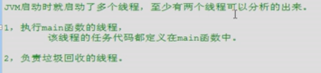
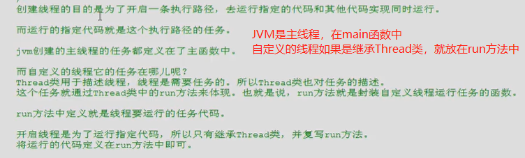
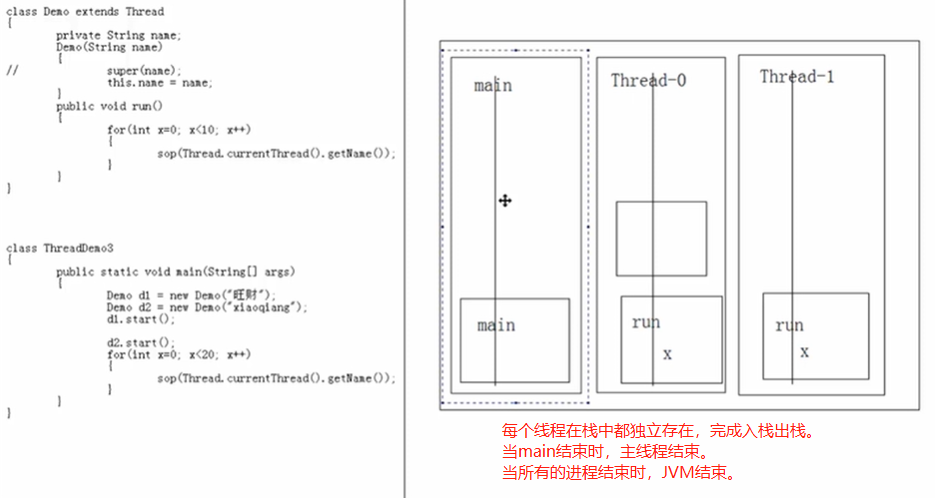

<!-- @import "[TOC]" {cmd="toc" depthFrom=1 depthTo=6 orderedList=false} -->

<!-- code_chunk_output -->

- [四、多线程（SE13-SE14）](#四-多线程se13-se14)
  - [SE13](#se13)
  - [4.1 多线程概述](#41-多线程概述)
  - [4.2 创建多线程](#42-创建多线程)
  - [4.3 线程的总结](#43-线程的总结)
- [五、常用对象API(SE15-SE20)](#五-常用对象apise15-se20)
- [六、IO流（SE21-SE24)](#六-io流se21-se24)
- [七、GUI(SE25)](#七-guise25)
- [八、网络编程(SE26)](#八-网络编程se26)

<!-- /code_chunk_output -->

# 四、多线程（SE13-SE14）
## SE13 
## 4.1 多线程概述

## 4.2 创建多线程
**方法一：继承Thread类**

但是当需要多线程的类本身有父类时，方法一就不能用了，这时使用方法二，用
接口实现。

**方法二：实现Runnable接口**

## 4.3 线程的总结
**多线程的内存图解**

**多线程的四种状态**

# 五、常用对象API(SE15-SE20)

# 六、IO流（SE21-SE24)

# 七、GUI(SE25)

# 八、网络编程(SE26)
