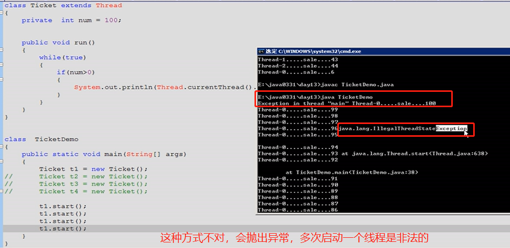
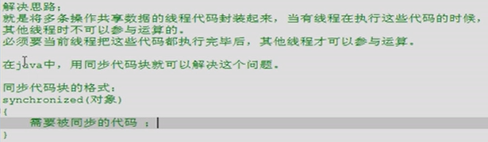

<!-- @import "[TOC]" {cmd="toc" depthFrom=1 depthTo=6 orderedList=false} -->

<!-- code_chunk_output -->

- [四、多线程（SE13-SE14）](#四-多线程se13-se14)
  - [SE13](#se13)
  - [4.1 多线程概述](#41-多线程概述)
  - [4.2 创建多线程](#42-创建多线程)
  - [4.3 线程的总结](#43-线程的总结)
  - [4.4 线程示例 - 买票](#44-线程示例-买票)
  - [4.5 多线程安全问题](#45-多线程安全问题)
- [五、常用对象API(SE15-SE20)](#五-常用对象apise15-se20)
- [六、IO流（SE21-SE24)](#六-io流se21-se24)
- [七、GUI(SE25)](#七-guise25)
- [八、网络编程(SE26)](#八-网络编程se26)

<!-- /code_chunk_output -->

# 四、多线程（SE13-SE14）
## SE13 
## 4.1 多线程概述


## 4.2 创建多线程
**方法一：继承Thread类**


但是当需要多线程的类本身有父类时，方法一就不能用了，这时使用方法二，用
接口实现。

**方法二：实现Runnable接口**


## 4.3 线程的总结
**多线程的内存图解**

**多线程的四种状态**


## 4.4 线程示例 - 买票
**方法一实现**


**方法二实现**


**易错点：**


## 4.5 多线程安全问题
**原因：多线程共享数据时，某个没处理完的线程被CPU打断，回来后数据不同了**


**解决方法：同步代码块**



**同步方法解决多线程安全问题的示例**
```java
// 需求： 储户，两个
//        每个都到银行存钱每次存100，存3次
class Bank{
  private int sum = 0;
  Object obj = new Object();
  public void add(int num){// add是多线程的代码，有共享数据
    synchronized(obj){    //用同步的方法，加一个锁
      sum = sum + num;
      System.out.println("bank sum = " + sum);
    }
  }
}

// 定义类实现Runnable，用于放线程的内容
class Cus implements Runnable{  
  private Bank b = new Bank ();
  public void run(){
    // Bank b = new Bank ();
    for (int x = 0 ; x< 3; x++){
      b.add(100); // add也是进程的代码
    }
  }
}

class BankDemo{
  public static void main(String[] args) {
    // 实例化Runnable子类的对象
    Cus c = new Cus();
    // 创建线程的对象，并传入Runnable子类的对象作为线程的内容
    Thread t1 = new Thread(c);
    Thread t2 = new Thread(c);
    // 通过Thread对象，运行多线程
    t1.start();
    t2.start();
    
  }
}
```

# 五、常用对象API(SE15-SE20)

# 六、IO流（SE21-SE24)

# 七、GUI(SE25)

# 八、网络编程(SE26)
