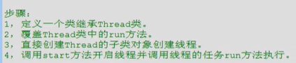
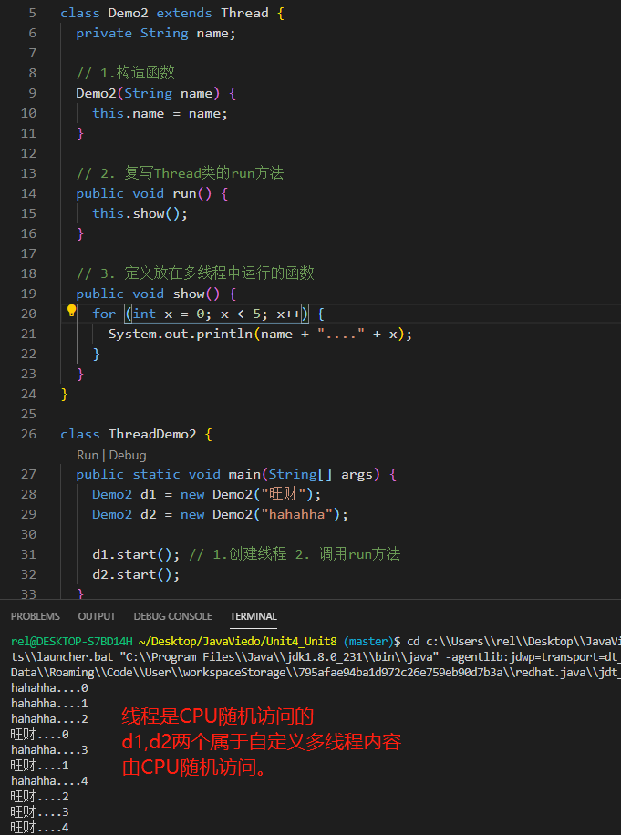
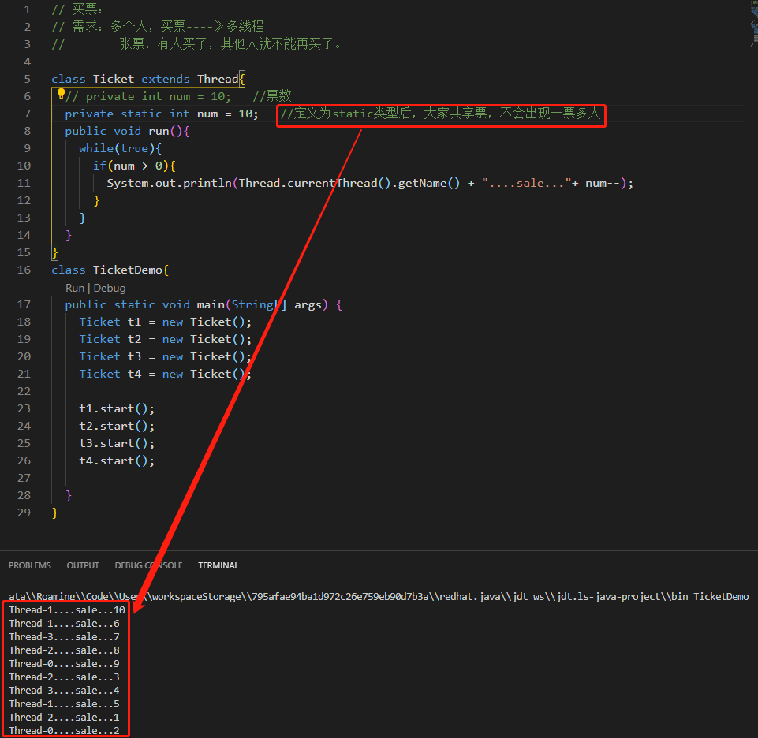
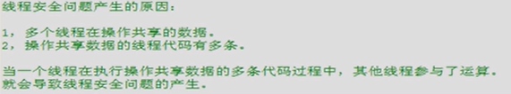

<!-- @import "[TOC]" {cmd="toc" depthFrom=1 depthTo=6 orderedList=false} -->

<!-- code_chunk_output -->

- [四、多线程（SE13-SE14）](#四-多线程se13-se14)
  - [SE13](#se13)
  - [4.1 多线程概述](#41-多线程概述)
  - [4.2 创建多线程](#42-创建多线程)
  - [4.3 线程的总结](#43-线程的总结)
  - [4.4 线程示例 - 买票](#44-线程示例-买票)
  - [4.5 多线程安全问题](#45-多线程安全问题)
  - [4.6 同步函数和同步代码块](#46-同步函数和同步代码块)
  - [4.7 多线程下的单例](#47-多线程下的单例)
  - [4.8 死锁](#48-死锁)
  - [SE14](#se14)
  - [4.9 线程间通信](#49-线程间通信)
  - [4.10 等待唤醒机制（未完成SE14）](#410-等待唤醒机制未完成se14)
- [五、常用对象API(SE15-SE20)](#五-常用对象apise15-se20)
  - [5.1 String类](#51-string类)
    - [5.1.1 String类基础知识](#511-string类基础知识)
    - [5.1.2 String类的方法](#512-string类的方法)
      - [**1、获取**](#1-获取)
      - [**2、转换**](#2-转换)
      - [**3、判断**](#3-判断)
      - [**4、比较**](#4-比较)
      - [**5、intern方法**](#5-intern方法)
    - [5.1.3 String的练习](#513-string的练习)
      - [**1、字符串的排序:StringTest1.java**](#1-字符串的排序stringtest1java)
      - [**2、一个子串在整串中出现的次数:StringTest2.java**](#2-一个子串在整串中出现的次数stringtest2java)
      - [**3、两个字符串中最大相同的子串：StringTest3.java**](#3-两个字符串中最大相同的子串stringtest3java)
      - [**4、模拟一个trim功能一致的方法：StringTest4.java**](#4-模拟一个trim功能一致的方法stringtest4java)
  - [5.2 对象包装类](#52-对象包装类)
    - [5.2.1 基本数据类型对象包装类概述](#521-基本数据类型对象包装类概述)
      - [**1、基本数据类型包装类的作用**](#1-基本数据类型包装类的作用)
      - [**2、基本数据类型包装类的进制转换**](#2-基本数据类型包装类的进制转换)
      - [**3、int和Integer的区别:**](#3-int和integer的区别)
      - [**4、JDK自动装箱拆箱**](#4-jdk自动装箱拆箱)
    - [5.2.2 基本数据类型对象包装类练习](#522-基本数据类型对象包装类练习)
  - [5.3 StringBuffer类](#53-stringbuffer类)
    - [5.3.1 StringBuffer特点](#531-stringbuffer特点)
    - [5.3.2 StringBuffer操作](#532-stringbuffer操作)
  - [5.4 StringBuilder类](#54-stringbuilder类)
    - [5.4.1 StringBuffer和StringBuilder对比](#541-stringbuffer和stringbuilder对比)
      - [不同点：](#不同点)
      - [联系：](#联系)
    - [5.4.2 StringBuilder类练习：StringBuilderTest.java](#542-stringbuilder类练习stringbuildertestjava)
    - [5.4.3 补充：JDK升级的原因](#543-补充jdk升级的原因)
      - [1、简化书写](#1-简化书写)
      - [2、提高效率](#2-提高效率)
      - [3、增加安全性](#3-增加安全性)
  - [5.5 集合框架:Collection](#55-集合框架collection)
    - [5.5.1 集合框架的概述](#551-集合框架的概述)
      - [1、集合框架的概述](#1-集合框架的概述)
      - [2、集合框架的方法](#2-集合框架的方法)
      - [3、补充：迭代器的原理](#3-补充迭代器的原理)
    - [5.5.2 Collection集合框架-List接口](#552-collection集合框架-list接口)
      - [1、List特点](#1-list特点)
      - [2、List方法](#2-list方法)
      - [3、迭代器在List中的使用](#3-迭代器在list中的使用)
      - [4、List的迭代器的练习：用listIterator实现在迭代器中对列表增删改查](#4-list的迭代器的练习用listiterator实现在迭代器中对列表增删改查)
      - [5、List的三个常用子类：Vector,ArrayList,LinkedList](#5-list的三个常用子类vectorarraylistlinkedlist)
        - [1、List之Vector](#1-list之vector)
        - [2、List之LinkedList](#2-list之linkedlist)
        - [3、List之ArrayList](#3-list之arraylist)
    - [5.5.3 Collection集合框架的-Set接口](#553-collection集合框架的-set接口)
      - [1、Set特点](#1-set特点)
      - [2、Set方法](#2-set方法)
      - [3、Set的两个常用子类HashSet,TreeSet](#3-set的两个常用子类hashsettreeset)
        - [1、Set之HashSet](#1-set之hashset)
        - [2、Set之TreeSet](#2-set之treeset)
- [六、IO流（SE21-SE24)](#六-io流se21-se24)
- [七、GUI(SE25)](#七-guise25)
- [八、网络编程(SE26)](#八-网络编程se26)

<!-- /code_chunk_output -->

# 四、多线程（SE13-SE14）
## SE13 
## 4.1 多线程概述


## 4.2 创建多线程
**方法一：继承Thread类**



但是当需要多线程的类本身有父类时，方法一就不能用了，这时使用方法二，用
接口实现。

**方法二：实现Runnable接口**


## 4.3 线程的总结
**多线程的内存图解**

**多线程的四种状态**


## 4.4 线程示例 - 买票
**方法一实现**


**方法二实现**


**易错点：**


## 4.5 多线程安全问题
**原因：多线程共享数据时，某个没处理完的线程被CPU打断，回来后数据不同了**



**解决方法：同步代码块**


**同步方法解决多线程安全问题的示例**
```java
// 需求： 储户，两个
//        每个都到银行存钱每次存100，存3次
class Bank{
  private int sum = 0;
  Object obj = new Object();
  public void add(int num){// add是多线程的代码，有共享数据
    synchronized(obj){    //用同步的方法，加一个锁
      sum = sum + num;
      System.out.println("bank sum = " + sum);
    }
  }
}

// 定义类实现Runnable，用于放线程的内容
class Cus implements Runnable{  
  private Bank b = new Bank ();
  public void run(){
    // Bank b = new Bank ();
    for (int x = 0 ; x< 3; x++){
      b.add(100); // add也是进程的代码
    }
  }
}

class BankDemo{
  public static void main(String[] args) {
    // 实例化Runnable子类的对象
    Cus c = new Cus();
    // 创建线程的对象，并传入Runnable子类的对象作为线程的内容
    Thread t1 = new Thread(c);
    Thread t2 = new Thread(c);
    // 通过Thread对象，运行多线程
    t1.start();
    t2.start();
    
  }
}
```
## 4.6 同步函数和同步代码块
**验证同步函数锁1（有疑问）**


**验证同步函数锁2（有疑问flag）**


**同步函数和同步代码块的对比**


**静态同步函数锁**

```java
// 买票：
// 需求：多个人，买票----》多线程
//      一张票，有人买了，其他人就不能再买了。

// 1. 搞清该同步那个部分：run? show？
//		如果同步run则0线程进来之后出不去，因为while (true)始终成立。
//		所以需要同步的是show()函数

// 2. 验证同步函数的锁
//		Thread-0在同步函数中买票
//		Thread-1在同步代码块中买票
//		如果两个Thread用的同一个锁的话就不会有安全隐患，这个通过flag实现。

class SynFunctionDemoTicket implements Runnable {
	private int num = 200; // 票数
	//Object obj = new Object();
	boolean flag = true;
	public void run() {
		if (flag) {// flag为true，Thread-0同步代码块买票
			while(true){
				synchronized (this) {
					if (this.num > 0) {
						try {Thread.sleep(10);} catch (InterruptedException e) {}
						System.out.println("flag:" + flag + " " + Thread.currentThread().getName()
						+ "....SynFunction obj..." + this.num--);
					}
				}				
			}
		} else {// flag为false，Thread-1同步函数show买票
			while (true) {this.show();}
		}
	}
	public synchronized void show() {// 同步函数防止多线程公用数据时发生错误
		if (this.num > 0) {
			try {Thread.sleep(10);} catch (InterruptedException e) {}
			System.out.println(
					"flag:" + flag + " " + Thread.currentThread().getName() 
					+ "....SynFunction fun..." + this.num--);
		}
	}
}
class SynFunctionDemo {
	public static void main(String[] args) {
		// 展示方法二
		SynFunctionDemoTicket t = new SynFunctionDemoTicket(); // 将并行处理的部分作为参数传给多线程的类Thread
		Thread t1 = new Thread(t);
		Thread t2 = new Thread(t);
		t1.start();
		// 在主线程开启了-0之后，把flag置为假之前，让主线程停一下，就剩-0线程运行
		try {Thread.sleep(10);} catch (InterruptedException e) {}
		t.flag = false;
		t2.start();
	}
}
```
## 4.7 多线程下的单例
```java
// // 饿汉式
// class Single{
// 	private static final Single s = new Single();
// 	private Single(){}
// 	public static Single getInstance(){
// 		return s;
// 	}
// }

// 懒汉式(面试！！！)
class Single {
	private static Single s = null;

	private Single() {
	}

	public static Single getInstance() {
		// 共享数据
		// 多条语句操作共享数据
		if (s == null) {
			synchronized (Single.class) {
				if (s == null) {
					s = new Single();
				}
			}
		}
		return s;
	}
}

//
class SingleDemo {
	public static void main(String[] args) {
		System.out.println("Hello world.");
	}
}
```
## 4.8 死锁
**死锁的情景-同步的嵌套**


## SE14
## 4.9 线程间通信


## 4.10 等待唤醒机制（未完成SE14）


# 五、常用对象API(SE15-SE20)
## 5.1 String类
### 5.1.1 String类基础知识


**不同String对象比较**
> s:创建一个对象，在常量池中，由String类维护，不可变，可共享。
> s1:创建两个对象：new的和“abc”在堆内存中。


### 5.1.2 String类的方法
#### **1、获取**


#### **2、转换**


#### **3、判断**
 String方法3_判断.png
#### **4、比较**
```java
package cn.itcast.pl.string.demo;

class StringMethodDemo{
	public static void main(String[] args) {
		System.out.println("hello world.");
		stringMethodDemo();
	}
	public static void stringMethodDemo(){
		// 1. 获取
		System.out.println("========== 1. 获取 =========");
		String s = "abcdecfa";
		System.out.println("s:" + s);
		System.out.println("length:" + s.length());
		System.out.println("char:" + s.charAt(2));
		System.out.println("index:" + s.indexOf("c"));
		System.out.println("lastIndex:" + s.lastIndexOf("a"));

		System.out.println("substring:" + s.substring(2,5));
		
		// 2. 转换
		String sz = "张三，李四，王五";
		System.out.println(" =========== 2. 转换 ==========");
		System.out.println("sz:" + sz);
		// 2.1 split
		String[] arr = sz.split("，");
		System.out.println("=======arr.length:" + arr.length); // 3
		for (int i = 0; i <arr.length; i++){
			System.out.println( arr[i]);
		}
		// 2.2 toCharArray 
		char[] chs = sz.toCharArray();
		System.out.println("=======chs.length:" + chs.length); // 8
		for (int i = 0; i <chs.length; i++){
			System.out.println( chs[i]);
		}
		// 2.3 getBytes
		String sz1 = "ab你";
		byte[] bytes = sz1.getBytes(); // 输出ASCII码
		System.out.println("=======bytes.length:" + bytes.length); //5
		System.out.println("sz1:" + sz1);
		for (int i = 0; i <bytes.length; i++){
			System.out.println( bytes[i]);
		}
		// 2.4 toUpperCase,toLowerCase 
		System.out.println("Abc".toUpperCase());
		System.out.println("Abc".toLowerCase());
		
		// 2.5 replace
		System.out.println("=======replace"); 
		String s1 = "java";
		String s2 = s1.replace("a", "p");
		System.out.println("s2: "+ s2);

		// 2.6 trim
		System.out.println("=======trim"); 
		String st1 = "  java";
		String st2 = st1.trim();
		System.out.println("st1: "+ st1 + "\n"+"st2: "+ st2);

		// 2.7 字符串进行连接concat
		System.out.println("=======concat"); 
		String sc1 = "java";
		String sc2 = "concat";
		System.out.println("sc1: "+ sc1 + "\n"+"sc2: "+ sc2);
		String sc3 = sc1.concat(sc2);
		System.out.println("sc1.concat(sc2): "+ sc3);

		// 3. 判断 返回值位boolean
		System.out.println(" =========== 3. 判断 ==========");
		String sp = "abc";
		// equals + toLowerCase
		System.out.println(sp.equals("ABC".toLowerCase()));// true
		// equalsIgnoreCase
		System.out.println(sp.equalsIgnoreCase("ABC"));//true
		// equals
		System.out.println(sp.equals("ABC"));//false
		// contains
		System.out.println(sp.contains("cc"));//false
		// start
		String str = "ArrayDemo.java";
		System.out.println(str.startsWith("Array"));//true
		System.out.println(str.endsWith(".java")); //true

		// 4. a
		System.out.println(" =========== 4. 判断 ==========");
		System.out.println("a compareTo A: " + "a".compareTo("A")); //true
	}
}
```
#### **5、intern方法**
返回字符串对象的规范化表示形式。

### 5.1.3 String的练习
#### **1、字符串的排序:StringTest1.java**


#### **2、一个子串在整串中出现的次数:StringTest2.java**


#### **3、两个字符串中最大相同的子串：StringTest3.java**


#### **4、模拟一个trim功能一致的方法：StringTest4.java**


## 5.2 对象包装类
### 5.2.1 基本数据类型对象包装类概述


#### **1、基本数据类型包装类的作用**


#### **2、基本数据类型包装类的进制转换**


#### **3、int和Integer的区别:**
>1、Integer是int的包装类，int则是java的一种基本数据类型 
2、Integer变量必须实例化后才能使用，而int变量不需要 
3、Integer实际是对象的引用，当new一个Integer时，实际上是生成一个指针指向此对象；而int则是直接存储数据值 
4、Integer的默认值是null，int的默认值是0

#### **4、JDK自动装箱拆箱**


### 5.2.2 基本数据类型对象包装类练习


## 5.3 StringBuffer类
### 5.3.1 StringBuffer特点


### 5.3.2 StringBuffer操作


## 5.4 StringBuilder类
### 5.4.1 StringBuffer和StringBuilder对比
#### 不同点：
> * StringBuffer类（旧：JDK1.0），是线程同步的，通常用于多线程。
> * StringBuilder类（新:JDK1.5），线程不同步，通常用于单线程，快。

#### 联系：
> jdk1.5以后出现了功能和StringBuffer一模一样的对象，就是StringBuilder。

### 5.4.2 StringBuilder类练习：StringBuilderTest.java
> 存完数据之后以字符串来用，就用StringBuffer或者StringBuilder类
```java
//  将int类型的数组变为字符串

class StringBuilderTest{
    public static void main(String[] args) {
        int [] arr = {1,4,3,5,6,7,9};
        System.out.println("arr:" + "\t" + arr);
        // 用String，字符串拼接
        String str = arrayToString1(arr);
        System.out.println("str:" + "\t" + str);
        // 用StringBuilder，append方法
        StringBuilder str2 = arrayToString2(arr);
        System.out.println("str2:" + "\t" + str2);

    }

    private static StringBuilder arrayToString2(int[] arr) {
        StringBuilder str = new StringBuilder();
        str.append("[");
        for(int i =0; i<arr.length; i++)
            if(i != arr.length-1){
                // str.append(arr[i]).append(",");
                str.append(arr[i] + ","); // 上一行的另一种写法
            }
            else{
                str.append(arr[i]).append("]");
            }
        return str;
    }
    public static String arrayToString1(int[] arr) {
        String str = "[";

        for(int i =0; i<arr.length; i++)
            if(i != arr.length-1){
                str += arr[i] +","; // 每一次都有一个字符串常量值
            }
            else{
                str += arr[i] +"]";
            }
        return str;
    }
}
```
### 5.4.3 补充：JDK升级的原因
#### 1、简化书写
####  2、提高效率
#### 3、增加安全性

## 5.5 集合框架:Collection

### 5.5.1 集合框架的概述

#### 1、集合框架的概述


#### 2、集合框架的方法


#### 3、补充：迭代器的原理


### 5.5.2 Collection集合框架-List接口
#### 1、List特点
> * 有序
> * 元素可重复
> * 元素有索引

#### 2、List方法


#### 3、迭代器在List中的使用
**Iterator方法总结**


**ListIterator**


#### 4、List的迭代器的练习：用listIterator实现在迭代器中对列表增删改查
```java
package src.cn.itcast.p4.list.demo;
import java.util.ArrayList;
import java.util.Iterator;
import java.util.List;
import java.util.ListIterator;
/*
在列表中使用迭代器操作时，在迭代器运算中（while(it.hasNext())）时：
1、不要使用集合操作元素（ list.add("abc9")），不然容易出现异常：
ConcurrentModificationException：这是因为同时用迭代器和列表操作，出现了矛盾冲突
2、可以使用迭代器Iterator接口的子接口ListIterator来完成在迭代中对元素的进行更多操作。
ListIterator实现在迭代中对集合修改。

*/
class ListDemo2{
    public static void main(String[] args) {
        List<String> list = new ArrayList<String>();

        list.add("abc1");
        list.add("abc2");
        list.add("abc3");
        list.add("abc4");
        
        addInIterator(list);
    }

    public static void addInIterator(List<String> list) {
        // ========== 易错点：在Iterator的迭代期间使用集合操作元素（ list.add("abc9")）
        // =========== 在Iterator的迭代期间使用集合操作元素（ list.add("abc9")），容易出现异常：
        // System.out.println("list:" + list);
        // Iterator<String> it = list.iterator();
        // while(it.hasNext()){
        //     Object obj = it.next();// 每一个it.next()都是一次运算
        //     if(obj.equals("abc2")){
        //         list.add("abc9");//java.util.ConcurrentModificationException
        //         System.out.println("add!");
        //     }
        //     else{
        //         System.out.println("it.next()" + obj);
        //     }
        // }
        // System.out.println("list:" + list);

        // ============= 改正：可以使用迭代器Iterator接口的子接口ListIterator
        // ============= 来完成在迭代中对元素的进行更多操作
        System.out.println("Orign list:" + list);
        ListIterator<String> it = list.listIterator();
        while(it.hasNext()){
            Object obj = it.next();
            if(obj.equals("abc2")){
                it.add("abc9");
                System.out.println("it.next()=" + obj + "\t==abc2");
            }else{
                System.out.println("it.next()=" + obj + "\t!=abc2");
            }
        }
        System.out.println("After listIterator list:" + list);
    }
}
```

#### 5、List的三个常用子类：Vector,ArrayList,LinkedList

**List的三个常用子类概述**


##### 1、List之Vector

**Enumeration与Iterator区别**

```java
package src.cn.itcast.p4.vector.demo;

import java.util.Enumeration;
import java.util.Iterator;
import java.util.Vector;

class VectorDemo{
	public static void main(String[] args) {

		Vector<String> v = new Vector<String>();

		v.addElement("abc1");
		v.addElement("abc2");
		v.addElement("abc3");
		v.addElement("abc4");
		
		Enumeration<String> en = v.elements();
		while(en.hasMoreElements()){
			System.out.println("nextElement:" + en.nextElement());
		}

		Iterator<String> it = v.iterator();
		while(it.hasNext()){
			System.out.println("next:" +it.next());
		}
		
	}
}
```

##### 2、List之LinkedList

```java
package src.cn.itcast.p4.linkedlist.test;

import java.util.LinkedList;

/* ====== 用LinkedList实现堆栈，队列 ======
堆栈(FILO)：先进后出,First In Last Out : addFirst(),removeLast()
队列(FIFO)：先进先出,First In First Out: addFirst(),removeFirst()
    为了实现描述数据结构，并定义他们的方法，采用类封装，
内部使用LinkedList实现。
*/

class MyDuiLie {
	// LinkedList是Java的链表
	private LinkedList<Object> link; 

	// 构造函数
	public MyDuiLie(){
		this.link = new LinkedList<Object>();
	}
	// add方法
	public void myAdd(Object obj){
		link.addLast(obj);
	}
	// get方法
	public Object myGet(){
		Object obj;
		// obj = link.getFirst();
		obj = link.removeFirst();
		return  obj;
	}
	// isNull用isEmpty实现
	public boolean isNull(){
		return link.isEmpty();
	}
}

class MyStack {
	// LinkedList是Java的链表
	private LinkedList<Object> link; 

	// 构造函数
	public MyStack(){
		this.link = new LinkedList<Object>();
	}
	// add方法
	public void myAdd(Object obj){
		link.addLast(obj);
	}
	// get方法
	public Object myGet(){
		Object obj;
		// obj = link.getFirst();
		obj = link.removeLast();
		return  obj;
	}
	// isNull用isEmpty实现
	public boolean isNull(){
		return link.isEmpty();
	}
}
class LinkedTest {
	public static void main(String[] args) {
		System.out.println("My DuiLie output:");
		MyDuiLie d1 = new MyDuiLie();
		d1.myAdd("abc1");
		d1.myAdd("abc2");
		d1.myAdd("abc3");
		d1.myAdd("abc4");
		while(!d1.isNull()){
			System.out.println(d1.myGet());
		}
		System.out.println("My Stack output:");
		MyStack s1 = new MyStack();
		s1.myAdd("abc1");
		s1.myAdd("abc2");
		s1.myAdd("abc3");
		s1.myAdd("abc4");

		while(!s1.isNull()){
			System.out.println(s1.myGet());
		}
	}
}
```
##### 3、List之ArrayList

```java
package src.cn.itcast.p4.arraylist.test;
/*
1、ArrayList的对象可以通过add，添加Person的对象：add(new Person(21,"lisi1"));
2、ArrayList的对象也可以使用迭代器，遍历其元素（Person的对象）。
3、当ArrayList的对象为另一个类的对象时，可以先强制类型转换，然后就可以调用其方法了。
*/ 
import java.util.ArrayList;
import java.util.Iterator;

import src.cn.itcast.p.bean.Person;

class ArrayListDemo {
	public static void main(String[] args) {
		ArrayList a1 = new ArrayList();

		a1.add(new Person(21,"lisi1"));
		a1.add(new Person(22,"lisi2"));
		a1.add(new Person(23,"lisi3"));
		a1.add(new Person(24,"lisi4"));
		 
		Iterator it = a1.iterator();
		while(it.hasNext()){
			// Object obj = it.next(); // it.next()出现一次，next自动往下走一次			
			// System.out.println("Person.getName: " + ((Person) obj).getName());// 类型转化后调用方法getName
			// System.out.println("Person.getAge: " + ((Person) obj).getAge());// 类型转化后调用方法getAge
			
			Person obj = (Person)it.next(); 
			System.out.println("\n全类名：" + obj);// 打印全类名
			System.out.println("类名getClass: " + obj.getClass());// 打印类名
			System.out.println("Person.getAge: " + obj.getAge() + "\tPerson.getName: " + obj.getName());
	
		}
		
	}
}
```


**java数组和链表比较**


**自动装箱,拆箱**
> * **自动装箱**：基本数据类型值赋值给引用数据类型值时
> * **自动拆箱**：基本数据类型和引用数据类型做运算的时候
```	java
    // 自动装箱eg1
    ArrayList a2 = new ArrayList();
    a2.add(1); // a2.add(new Integer(5));
    
    // 自动装箱eg2
   
    {
       show1(6);
    }
    public static void show1(Object obj){
      System.out.print(obj);// show(new Integer(6));
    }
    // 不用自动装箱：类型匹配，正常运行
    show2(6);
    public static void show2(int num){
      System.out.print(num);
    }
    // 自动拆箱：基本数据类型和引用数据类型做运算的时候
    public static void show3(Integer num){
      num + 8;
    }
```    
### 5.5.3 Collection集合框架的-Set接口
#### 1、Set特点
> * 无序（也有有序的情况）
> * 元素不可重复
#### 2、Set方法 

#### 3、Set的两个常用子类HashSet,TreeSet
##### 1、Set之HashSet
**HashSet概述**


**HashSet说明**


**哈希表的两个判断**


**哈希表的两个判断的疑问**


**HashSet练习举例**


##### 2、Set之TreeSet


# 六、IO流（SE21-SE24)

# 七、GUI(SE25)

# 八、网络编程(SE26)
