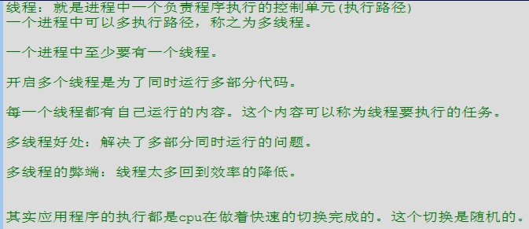
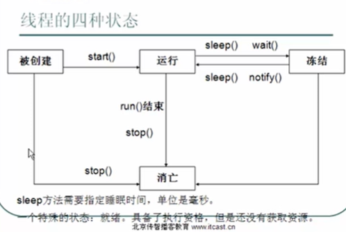
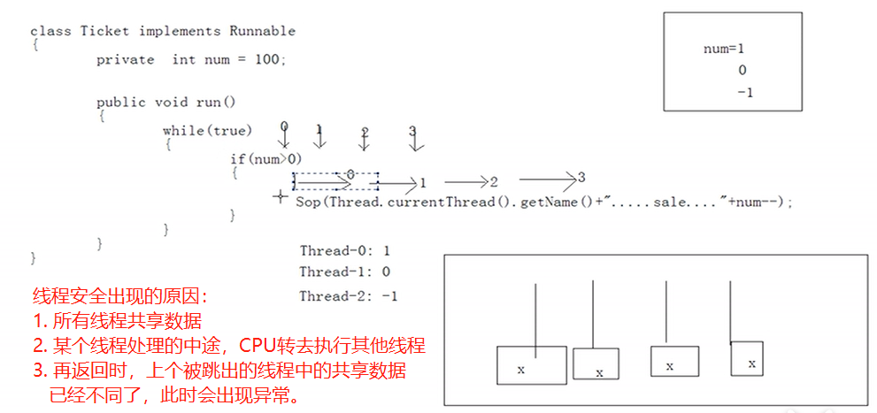
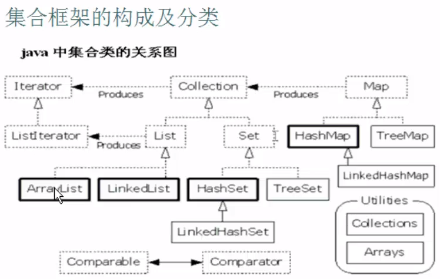
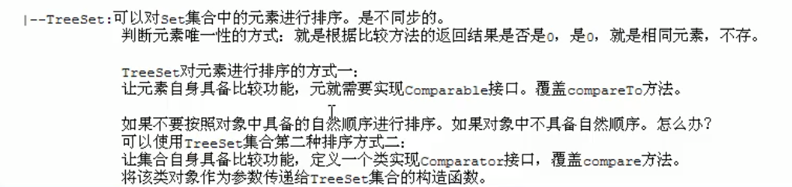

<!-- @import "[TOC]" {cmd="toc" depthFrom=1 depthTo=6 orderedList=false} -->

<!-- code_chunk_output -->

- [四、多线程（SE13-SE14）](#%e5%9b%9b%e5%a4%9a%e7%ba%bf%e7%a8%8bse13-se14)
	- [SE13](#se13)
	- [4.1 多线程概述](#41-%e5%a4%9a%e7%ba%bf%e7%a8%8b%e6%a6%82%e8%bf%b0)
	- [4.2 创建多线程](#42-%e5%88%9b%e5%bb%ba%e5%a4%9a%e7%ba%bf%e7%a8%8b)
	- [4.3 线程的总结](#43-%e7%ba%bf%e7%a8%8b%e7%9a%84%e6%80%bb%e7%bb%93)
	- [4.4 线程示例 - 买票](#44-%e7%ba%bf%e7%a8%8b%e7%a4%ba%e4%be%8b---%e4%b9%b0%e7%a5%a8)
	- [4.5 多线程安全问题](#45-%e5%a4%9a%e7%ba%bf%e7%a8%8b%e5%ae%89%e5%85%a8%e9%97%ae%e9%a2%98)
	- [4.6 同步函数和同步代码块](#46-%e5%90%8c%e6%ad%a5%e5%87%bd%e6%95%b0%e5%92%8c%e5%90%8c%e6%ad%a5%e4%bb%a3%e7%a0%81%e5%9d%97)
	- [4.7 多线程下的单例](#47-%e5%a4%9a%e7%ba%bf%e7%a8%8b%e4%b8%8b%e7%9a%84%e5%8d%95%e4%be%8b)
	- [4.8 死锁](#48-%e6%ad%bb%e9%94%81)
	- [SE14](#se14)
	- [4.9 线程间通信](#49-%e7%ba%bf%e7%a8%8b%e9%97%b4%e9%80%9a%e4%bf%a1)
	- [4.10 等待唤醒机制（未完成SE14）](#410-%e7%ad%89%e5%be%85%e5%94%a4%e9%86%92%e6%9c%ba%e5%88%b6%e6%9c%aa%e5%ae%8c%e6%88%90se14)
- [五、常用对象API(SE15-SE20)](#%e4%ba%94%e5%b8%b8%e7%94%a8%e5%af%b9%e8%b1%a1apise15-se20)
	- [5.1 String类](#51-string%e7%b1%bb)
		- [5.1.1 String类基础知识](#511-string%e7%b1%bb%e5%9f%ba%e7%a1%80%e7%9f%a5%e8%af%86)
		- [5.1.2 String类的方法](#512-string%e7%b1%bb%e7%9a%84%e6%96%b9%e6%b3%95)
			- [1、获取](#1%e8%8e%b7%e5%8f%96)
			- [2、转换](#2%e8%bd%ac%e6%8d%a2)
			- [3、判断](#3%e5%88%a4%e6%96%ad)
			- [4、比较](#4%e6%af%94%e8%be%83)
			- [5、intern方法](#5intern%e6%96%b9%e6%b3%95)
		- [5.1.3 String的练习](#513-string%e7%9a%84%e7%bb%83%e4%b9%a0)
			- [1、字符串的排序:StringTest1.java](#1%e5%ad%97%e7%ac%a6%e4%b8%b2%e7%9a%84%e6%8e%92%e5%ba%8fstringtest1java)
			- [2、一个子串在整串中出现的次数:StringTest2.java](#2%e4%b8%80%e4%b8%aa%e5%ad%90%e4%b8%b2%e5%9c%a8%e6%95%b4%e4%b8%b2%e4%b8%ad%e5%87%ba%e7%8e%b0%e7%9a%84%e6%ac%a1%e6%95%b0stringtest2java)
			- [3、两个字符串中最大相同的子串：StringTest3.java](#3%e4%b8%a4%e4%b8%aa%e5%ad%97%e7%ac%a6%e4%b8%b2%e4%b8%ad%e6%9c%80%e5%a4%a7%e7%9b%b8%e5%90%8c%e7%9a%84%e5%ad%90%e4%b8%b2stringtest3java)
			- [4、模拟一个trim功能一致的方法：StringTest4.java](#4%e6%a8%a1%e6%8b%9f%e4%b8%80%e4%b8%aatrim%e5%8a%9f%e8%83%bd%e4%b8%80%e8%87%b4%e7%9a%84%e6%96%b9%e6%b3%95stringtest4java)
	- [5.2 对象包装类](#52-%e5%af%b9%e8%b1%a1%e5%8c%85%e8%a3%85%e7%b1%bb)
		- [5.2.1 基本数据类型对象包装类概述](#521-%e5%9f%ba%e6%9c%ac%e6%95%b0%e6%8d%ae%e7%b1%bb%e5%9e%8b%e5%af%b9%e8%b1%a1%e5%8c%85%e8%a3%85%e7%b1%bb%e6%a6%82%e8%bf%b0)
			- [1、基本数据类型包装类的作用](#1%e5%9f%ba%e6%9c%ac%e6%95%b0%e6%8d%ae%e7%b1%bb%e5%9e%8b%e5%8c%85%e8%a3%85%e7%b1%bb%e7%9a%84%e4%bd%9c%e7%94%a8)
			- [2、基本数据类型包装类的进制转换](#2%e5%9f%ba%e6%9c%ac%e6%95%b0%e6%8d%ae%e7%b1%bb%e5%9e%8b%e5%8c%85%e8%a3%85%e7%b1%bb%e7%9a%84%e8%bf%9b%e5%88%b6%e8%bd%ac%e6%8d%a2)
			- [3、int和Integer的区别:](#3int%e5%92%8cinteger%e7%9a%84%e5%8c%ba%e5%88%ab)
			- [4、JDK自动装箱拆箱](#4jdk%e8%87%aa%e5%8a%a8%e8%a3%85%e7%ae%b1%e6%8b%86%e7%ae%b1)
		- [5.2.2 基本数据类型对象包装类练习](#522-%e5%9f%ba%e6%9c%ac%e6%95%b0%e6%8d%ae%e7%b1%bb%e5%9e%8b%e5%af%b9%e8%b1%a1%e5%8c%85%e8%a3%85%e7%b1%bb%e7%bb%83%e4%b9%a0)
	- [5.3 StringBuffer类](#53-stringbuffer%e7%b1%bb)
		- [5.3.1 StringBuffer特点](#531-stringbuffer%e7%89%b9%e7%82%b9)
		- [5.3.2 StringBuffer操作](#532-stringbuffer%e6%93%8d%e4%bd%9c)
	- [5.4 StringBuilder类](#54-stringbuilder%e7%b1%bb)
		- [5.4.1 StringBuffer和StringBuilder对比](#541-stringbuffer%e5%92%8cstringbuilder%e5%af%b9%e6%af%94)
			- [不同点：](#%e4%b8%8d%e5%90%8c%e7%82%b9)
			- [联系：](#%e8%81%94%e7%b3%bb)
		- [5.4.2 StringBuilder类练习：StringBuilderTest.java](#542-stringbuilder%e7%b1%bb%e7%bb%83%e4%b9%a0stringbuildertestjava)
		- [5.4.3 补充：JDK升级的原因](#543-%e8%a1%a5%e5%85%85jdk%e5%8d%87%e7%ba%a7%e7%9a%84%e5%8e%9f%e5%9b%a0)
			- [1、简化书写](#1%e7%ae%80%e5%8c%96%e4%b9%a6%e5%86%99)
			- [2、提高效率](#2%e6%8f%90%e9%ab%98%e6%95%88%e7%8e%87)
			- [3、增加安全性](#3%e5%a2%9e%e5%8a%a0%e5%ae%89%e5%85%a8%e6%80%a7)
	- [5.5 集合框架：Collection和Map](#55-%e9%9b%86%e5%90%88%e6%a1%86%e6%9e%b6collection%e5%92%8cmap)
		- [5.5.1 集合框架的概述](#551-%e9%9b%86%e5%90%88%e6%a1%86%e6%9e%b6%e7%9a%84%e6%a6%82%e8%bf%b0)
		- [5.5.2 集合框架分类](#552-%e9%9b%86%e5%90%88%e6%a1%86%e6%9e%b6%e5%88%86%e7%b1%bb)
			- [1、集合框架的构成与分类](#1%e9%9b%86%e5%90%88%e6%a1%86%e6%9e%b6%e7%9a%84%e6%9e%84%e6%88%90%e4%b8%8e%e5%88%86%e7%b1%bb)
			- [2、Collection和Map的区别](#2collection%e5%92%8cmap%e7%9a%84%e5%8c%ba%e5%88%ab)
		- [5.5.2 Collection](#552-collection)
			- [1、Collection的方法](#1collection%e7%9a%84%e6%96%b9%e6%b3%95)
			- [2、补充：迭代器的原理](#2%e8%a1%a5%e5%85%85%e8%bf%ad%e4%bb%a3%e5%99%a8%e7%9a%84%e5%8e%9f%e7%90%86)
		- [5.5.2 Collection之List](#552-collection%e4%b9%8blist)
			- [3、List特点](#3list%e7%89%b9%e7%82%b9)
			- [4、List方法](#4list%e6%96%b9%e6%b3%95)
			- [5、迭代器在List中的使用](#5%e8%bf%ad%e4%bb%a3%e5%99%a8%e5%9c%a8list%e4%b8%ad%e7%9a%84%e4%bd%bf%e7%94%a8)
			- [6、List的迭代器的练习：用listIterator实现在迭代器中对列表增删改查](#6list%e7%9a%84%e8%bf%ad%e4%bb%a3%e5%99%a8%e7%9a%84%e7%bb%83%e4%b9%a0%e7%94%a8listiterator%e5%ae%9e%e7%8e%b0%e5%9c%a8%e8%bf%ad%e4%bb%a3%e5%99%a8%e4%b8%ad%e5%af%b9%e5%88%97%e8%a1%a8%e5%a2%9e%e5%88%a0%e6%94%b9%e6%9f%a5)
			- [5、List的三个常用子类：Vector,ArrayList,LinkedList](#5list%e7%9a%84%e4%b8%89%e4%b8%aa%e5%b8%b8%e7%94%a8%e5%ad%90%e7%b1%bbvectorarraylistlinkedlist)
				- [1、List之Vector](#1list%e4%b9%8bvector)
				- [2、List之LinkedList](#2list%e4%b9%8blinkedlist)
				- [3、List之ArrayList](#3list%e4%b9%8barraylist)
		- [5.5.3 Collection之Set接口](#553-collection%e4%b9%8bset%e6%8e%a5%e5%8f%a3)
			- [1、Set特点](#1set%e7%89%b9%e7%82%b9)
			- [2、Set方法](#2set%e6%96%b9%e6%b3%95)
			- [3、Set的两个常用子类HashSet,TreeSet](#3set%e7%9a%84%e4%b8%a4%e4%b8%aa%e5%b8%b8%e7%94%a8%e5%ad%90%e7%b1%bbhashsettreeset)
				- [1、Set之HashSet](#1set%e4%b9%8bhashset)
				- [2、Set之TreeSet](#2set%e4%b9%8btreeset)
		- [5.5.4 Collection的List与Set小结](#554-collection%e7%9a%84list%e4%b8%8eset%e5%b0%8f%e7%bb%93)
		- [5.5.6、Map&lt;K,V&gt;](#556mapltkvgt)
			- [1、Map概述](#1map%e6%a6%82%e8%bf%b0)
			- [2、Map的常用子类](#2map%e7%9a%84%e5%b8%b8%e7%94%a8%e5%ad%90%e7%b1%bb)
				- [Map之Hashtable](#map%e4%b9%8bhashtable)
				- [Map之HashMap](#map%e4%b9%8bhashmap)
				- [Map之TreeMap](#map%e4%b9%8btreemap)
	- [5.6 泛型](#56-%e6%b3%9b%e5%9e%8b)
		- [5.6.1 泛型的概述](#561-%e6%b3%9b%e5%9e%8b%e7%9a%84%e6%a6%82%e8%bf%b0)
		- [5.6.2 集合之泛型类](#562-%e9%9b%86%e5%90%88%e4%b9%8b%e6%b3%9b%e5%9e%8b%e7%b1%bb)
			- [1、泛型自定义类的演示](#1%e6%b3%9b%e5%9e%8b%e8%87%aa%e5%ae%9a%e4%b9%89%e7%b1%bb%e7%9a%84%e6%bc%94%e7%a4%ba)
			- [2、泛型通配符:GenericDefineDemo5.java](#2%e6%b3%9b%e5%9e%8b%e9%80%9a%e9%85%8d%e7%ac%a6genericdefinedemo5java)
	- [5.7 集合框架小结](#57-%e9%9b%86%e5%90%88%e6%a1%86%e6%9e%b6%e5%b0%8f%e7%bb%93)
- [六、IO流（SE21-SE24)](#%e5%85%adio%e6%b5%81se21-se24)
- [七、GUI(SE25)](#%e4%b8%83guise25)
- [八、网络编程(SE26)](#%e5%85%ab%e7%bd%91%e7%bb%9c%e7%bc%96%e7%a8%8bse26)

<!-- /code_chunk_output -->

# 四、多线程（SE13-SE14）
## SE13 
## 4.1 多线程概述



## 4.2 创建多线程
**方法一：继承Thread类**


但是当需要多线程的类本身有父类时，方法一就不能用了，这时使用方法二，用
接口实现。

**方法二：实现Runnable接口**


## 4.3 线程的总结
**多线程的内存图解**

**多线程的四种状态**


## 4.4 线程示例 - 买票
**方法一实现**


**方法二实现**


**易错点：**


## 4.5 多线程安全问题
**原因：多线程共享数据时，某个没处理完的线程被CPU打断，回来后数据不同了**



**解决方法：同步代码块**


**同步方法解决多线程安全问题的示例**
```java
// 需求： 储户，两个
//        每个都到银行存钱每次存100，存3次
class Bank{
  private int sum = 0;
  Object obj = new Object();
  public void add(int num){// add是多线程的代码，有共享数据
    synchronized(obj){    //用同步的方法，加一个锁
      sum = sum + num;
      System.out.println("bank sum = " + sum);
    }
  }
}

// 定义类实现Runnable，用于放线程的内容
class Cus implements Runnable{  
  private Bank b = new Bank ();
  public void run(){
    // Bank b = new Bank ();
    for (int x = 0 ; x< 3; x++){
      b.add(100); // add也是进程的代码
    }
  }
}

class BankDemo{
  public static void main(String[] args) {
    // 实例化Runnable子类的对象
    Cus c = new Cus();
    // 创建线程的对象，并传入Runnable子类的对象作为线程的内容
    Thread t1 = new Thread(c);
    Thread t2 = new Thread(c);
    // 通过Thread对象，运行多线程
    t1.start();
    t2.start();
    
  }
}
```
## 4.6 同步函数和同步代码块
**验证同步函数锁1（有疑问）**


**验证同步函数锁2（有疑问flag）**


**同步函数和同步代码块的对比**


**静态同步函数锁**

```java
// 买票：
// 需求：多个人，买票----》多线程
//      一张票，有人买了，其他人就不能再买了。

// 1. 搞清该同步那个部分：run? show？
//		如果同步run则0线程进来之后出不去，因为while (true)始终成立。
//		所以需要同步的是show()函数

// 2. 验证同步函数的锁
//		Thread-0在同步函数中买票
//		Thread-1在同步代码块中买票
//		如果两个Thread用的同一个锁的话就不会有安全隐患，这个通过flag实现。

class SynFunctionDemoTicket implements Runnable {
	private int num = 200; // 票数
	//Object obj = new Object();
	boolean flag = true;
	public void run() {
		if (flag) {// flag为true，Thread-0同步代码块买票
			while(true){
				synchronized (this) {
					if (this.num > 0) {
						try {Thread.sleep(10);} catch (InterruptedException e) {}
						System.out.println("flag:" + flag + " " + Thread.currentThread().getName()
						+ "....SynFunction obj..." + this.num--);
					}
				}				
			}
		} else {// flag为false，Thread-1同步函数show买票
			while (true) {this.show();}
		}
	}
	public synchronized void show() {// 同步函数防止多线程公用数据时发生错误
		if (this.num > 0) {
			try {Thread.sleep(10);} catch (InterruptedException e) {}
			System.out.println(
					"flag:" + flag + " " + Thread.currentThread().getName() 
					+ "....SynFunction fun..." + this.num--);
		}
	}
}
class SynFunctionDemo {
	public static void main(String[] args) {
		// 展示方法二
		SynFunctionDemoTicket t = new SynFunctionDemoTicket(); // 将并行处理的部分作为参数传给多线程的类Thread
		Thread t1 = new Thread(t);
		Thread t2 = new Thread(t);
		t1.start();
		// 在主线程开启了-0之后，把flag置为假之前，让主线程停一下，就剩-0线程运行
		try {Thread.sleep(10);} catch (InterruptedException e) {}
		t.flag = false;
		t2.start();
	}
}
```
## 4.7 多线程下的单例
```java
// // 饿汉式
// class Single{
// 	private static final Single s = new Single();
// 	private Single(){}
// 	public static Single getInstance(){
// 		return s;
// 	}
// }

// 懒汉式(面试！！！)
class Single {
	private static Single s = null;

	private Single() {
	}

	public static Single getInstance() {
		// 共享数据
		// 多条语句操作共享数据
		if (s == null) {
			synchronized (Single.class) {
				if (s == null) {
					s = new Single();
				}
			}
		}
		return s;
	}
}

//
class SingleDemo {
	public static void main(String[] args) {
		System.out.println("Hello world.");
	}
}
```
## 4.8 死锁
**死锁的情景-同步的嵌套**


## SE14
## 4.9 线程间通信


## 4.10 等待唤醒机制（未完成SE14）


# 五、常用对象API(SE15-SE20)
## 5.1 String类
### 5.1.1 String类基础知识


**不同String对象比较**
> s:创建一个对象，在常量池中，由String类维护，不可变，可共享。
> s1:创建两个对象：new的和“abc”在堆内存中。


### 5.1.2 String类的方法
#### **1、获取**


#### **2、转换**


#### **3、判断**
 String方法3_判断.png
#### **4、比较**
```java
package cn.itcast.pl.string.demo;

class StringMethodDemo{
	public static void main(String[] args) {
		System.out.println("hello world.");
		stringMethodDemo();
	}
	public static void stringMethodDemo(){
		// 1. 获取
		System.out.println("========== 1. 获取 =========");
		String s = "abcdecfa";
		System.out.println("s:" + s);
		System.out.println("length:" + s.length());
		System.out.println("char:" + s.charAt(2));
		System.out.println("index:" + s.indexOf("c"));
		System.out.println("lastIndex:" + s.lastIndexOf("a"));

		System.out.println("substring:" + s.substring(2,5));
		
		// 2. 转换
		String sz = "张三，李四，王五";
		System.out.println(" =========== 2. 转换 ==========");
		System.out.println("sz:" + sz);
		// 2.1 split
		String[] arr = sz.split("，");
		System.out.println("=======arr.length:" + arr.length); // 3
		for (int i = 0; i <arr.length; i++){
			System.out.println( arr[i]);
		}
		// 2.2 toCharArray 
		char[] chs = sz.toCharArray();
		System.out.println("=======chs.length:" + chs.length); // 8
		for (int i = 0; i <chs.length; i++){
			System.out.println( chs[i]);
		}
		// 2.3 getBytes
		String sz1 = "ab你";
		byte[] bytes = sz1.getBytes(); // 输出ASCII码
		System.out.println("=======bytes.length:" + bytes.length); //5
		System.out.println("sz1:" + sz1);
		for (int i = 0; i <bytes.length; i++){
			System.out.println( bytes[i]);
		}
		// 2.4 toUpperCase,toLowerCase 
		System.out.println("Abc".toUpperCase());
		System.out.println("Abc".toLowerCase());
		
		// 2.5 replace
		System.out.println("=======replace"); 
		String s1 = "java";
		String s2 = s1.replace("a", "p");
		System.out.println("s2: "+ s2);

		// 2.6 trim
		System.out.println("=======trim"); 
		String st1 = "  java";
		String st2 = st1.trim();
		System.out.println("st1: "+ st1 + "\n"+"st2: "+ st2);

		// 2.7 字符串进行连接concat
		System.out.println("=======concat"); 
		String sc1 = "java";
		String sc2 = "concat";
		System.out.println("sc1: "+ sc1 + "\n"+"sc2: "+ sc2);
		String sc3 = sc1.concat(sc2);
		System.out.println("sc1.concat(sc2): "+ sc3);

		// 3. 判断 返回值位boolean
		System.out.println(" =========== 3. 判断 ==========");
		String sp = "abc";
		// equals + toLowerCase
		System.out.println(sp.equals("ABC".toLowerCase()));// true
		// equalsIgnoreCase
		System.out.println(sp.equalsIgnoreCase("ABC"));//true
		// equals
		System.out.println(sp.equals("ABC"));//false
		// contains
		System.out.println(sp.contains("cc"));//false
		// start
		String str = "ArrayDemo.java";
		System.out.println(str.startsWith("Array"));//true
		System.out.println(str.endsWith(".java")); //true

		// 4. a
		System.out.println(" =========== 4. 判断 ==========");
		System.out.println("a compareTo A: " + "a".compareTo("A")); //true
	}
}
```
#### **5、intern方法**
返回字符串对象的规范化表示形式。

### 5.1.3 String的练习
#### **1、字符串的排序:StringTest1.java**


#### **2、一个子串在整串中出现的次数:StringTest2.java**


#### **3、两个字符串中最大相同的子串：StringTest3.java**


#### **4、模拟一个trim功能一致的方法：StringTest4.java**


## 5.2 对象包装类
### 5.2.1 基本数据类型对象包装类概述


#### **1、基本数据类型包装类的作用**


#### **2、基本数据类型包装类的进制转换**


#### **3、int和Integer的区别:**
>1、Integer是int的包装类，int则是java的一种基本数据类型 
2、Integer变量必须实例化后才能使用，而int变量不需要 
3、Integer实际是对象的引用，当new一个Integer时，实际上是生成一个指针指向此对象；而int则是直接存储数据值 
4、Integer的默认值是null，int的默认值是0

#### **4、JDK自动装箱拆箱**


### 5.2.2 基本数据类型对象包装类练习


## 5.3 StringBuffer类
### 5.3.1 StringBuffer特点


### 5.3.2 StringBuffer操作


## 5.4 StringBuilder类
### 5.4.1 StringBuffer和StringBuilder对比
#### 不同点：
> * StringBuffer类（旧：JDK1.0），是线程同步的，通常用于多线程。
> * StringBuilder类（新:JDK1.5），线程不同步，通常用于单线程，快。

#### 联系：
> jdk1.5以后出现了功能和StringBuffer一模一样的对象，就是StringBuilder。

### 5.4.2 StringBuilder类练习：StringBuilderTest.java
> 存完数据之后以字符串来用，就用StringBuffer或者StringBuilder类
```java
//  将int类型的数组变为字符串

class StringBuilderTest{
    public static void main(String[] args) {
        int [] arr = {1,4,3,5,6,7,9};
        System.out.println("arr:" + "\t" + arr);
        // 用String，字符串拼接
        String str = arrayToString1(arr);
        System.out.println("str:" + "\t" + str);
        // 用StringBuilder，append方法
        StringBuilder str2 = arrayToString2(arr);
        System.out.println("str2:" + "\t" + str2);

    }

    private static StringBuilder arrayToString2(int[] arr) {
        StringBuilder str = new StringBuilder();
        str.append("[");
        for(int i =0; i<arr.length; i++)
            if(i != arr.length-1){
                // str.append(arr[i]).append(",");
                str.append(arr[i] + ","); // 上一行的另一种写法
            }
            else{
                str.append(arr[i]).append("]");
            }
        return str;
    }
    public static String arrayToString1(int[] arr) {
        String str = "[";

        for(int i =0; i<arr.length; i++)
            if(i != arr.length-1){
                str += arr[i] +","; // 每一次都有一个字符串常量值
            }
            else{
                str += arr[i] +"]";
            }
        return str;
    }
}
```
### 5.4.3 补充：JDK升级的原因
#### 1、简化书写
####  2、提高效率
#### 3、增加安全性

## 5.5 集合框架：Collection和Map

### 5.5.1 集合框架的概述


### 5.5.2 集合框架分类

#### 1、集合框架的构成与分类

#### 2、Collection和Map的区别


### 5.5.2 Collection

#### 1、Collection的方法

#### 2、补充：迭代器的原理


### 5.5.2 Collection之List
#### 3、List特点
> * 有序
> * 元素可重复
> * 元素有索引

#### 4、List方法


#### 5、迭代器在List中的使用
**Iterator方法总结**


**ListIterator**


#### 6、List的迭代器的练习：用listIterator实现在迭代器中对列表增删改查
```java
package src.cn.itcast.p4.list.demo;
import java.util.ArrayList;
import java.util.Iterator;
import java.util.List;
import java.util.ListIterator;
/*
在列表中使用迭代器操作时，在迭代器运算中（while(it.hasNext())）时：
1、不要使用集合操作元素（ list.add("abc9")），不然容易出现异常：
ConcurrentModificationException：这是因为同时用迭代器和列表操作，出现了矛盾冲突
2、可以使用迭代器Iterator接口的子接口ListIterator来完成在迭代中对元素的进行更多操作。
ListIterator实现在迭代中对集合修改。

*/
class ListDemo2{
    public static void main(String[] args) {
        List<String> list = new ArrayList<String>();

        list.add("abc1");
        list.add("abc2");
        list.add("abc3");
        list.add("abc4");
        
        addInIterator(list);
    }

    public static void addInIterator(List<String> list) {
        // ========== 易错点：在Iterator的迭代期间使用集合操作元素（ list.add("abc9")）
        // =========== 在Iterator的迭代期间使用集合操作元素（ list.add("abc9")），容易出现异常：
        // System.out.println("list:" + list);
        // Iterator<String> it = list.iterator();
        // while(it.hasNext()){
        //     Object obj = it.next();// 每一个it.next()都是一次运算
        //     if(obj.equals("abc2")){
        //         list.add("abc9");//java.util.ConcurrentModificationException
        //         System.out.println("add!");
        //     }
        //     else{
        //         System.out.println("it.next()" + obj);
        //     }
        // }
        // System.out.println("list:" + list);

        // ============= 改正：可以使用迭代器Iterator接口的子接口ListIterator
        // ============= 来完成在迭代中对元素的进行更多操作
        System.out.println("Orign list:" + list);
        ListIterator<String> it = list.listIterator();
        while(it.hasNext()){
            Object obj = it.next();
            if(obj.equals("abc2")){
                it.add("abc9");
                System.out.println("it.next()=" + obj + "\t==abc2");
            }else{
                System.out.println("it.next()=" + obj + "\t!=abc2");
            }
        }
        System.out.println("After listIterator list:" + list);
    }
}
```

#### 5、List的三个常用子类：Vector,ArrayList,LinkedList


**List的三个常用子类概述**


##### 1、List之Vector

**Enumeration与Iterator区别**

```java
package src.cn.itcast.p4.vector.demo;

import java.util.Enumeration;
import java.util.Iterator;
import java.util.Vector;

class VectorDemo{
	public static void main(String[] args) {

		Vector<String> v = new Vector<String>();

		v.addElement("abc1");
		v.addElement("abc2");
		v.addElement("abc3");
		v.addElement("abc4");
		
		Enumeration<String> en = v.elements();
		while(en.hasMoreElements()){
			System.out.println("nextElement:" + en.nextElement());
		}

		Iterator<String> it = v.iterator();
		while(it.hasNext()){
			System.out.println("next:" +it.next());
		}
		
	}
}
```

##### 2、List之LinkedList

```java
package src.cn.itcast.p4.linkedlist.test;

import java.util.LinkedList;

/* ====== 用LinkedList实现堆栈，队列 ======
堆栈(FILO)：先进后出,First In Last Out : addFirst(),removeLast()
队列(FIFO)：先进先出,First In First Out: addFirst(),removeFirst()
    为了实现描述数据结构，并定义他们的方法，采用类封装，
内部使用LinkedList实现。
*/

class MyDuiLie {
	// LinkedList是Java的链表
	private LinkedList<Object> link; 

	// 构造函数
	public MyDuiLie(){
		this.link = new LinkedList<Object>();
	}
	// add方法
	public void myAdd(Object obj){
		link.addLast(obj);
	}
	// get方法
	public Object myGet(){
		Object obj;
		// obj = link.getFirst();
		obj = link.removeFirst();
		return  obj;
	}
	// isNull用isEmpty实现
	public boolean isNull(){
		return link.isEmpty();
	}
}

class MyStack {
	// LinkedList是Java的链表
	private LinkedList<Object> link; 

	// 构造函数
	public MyStack(){
		this.link = new LinkedList<Object>();
	}
	// add方法
	public void myAdd(Object obj){
		link.addLast(obj);
	}
	// get方法
	public Object myGet(){
		Object obj;
		// obj = link.getFirst();
		obj = link.removeLast();
		return  obj;
	}
	// isNull用isEmpty实现
	public boolean isNull(){
		return link.isEmpty();
	}
}
class LinkedTest {
	public static void main(String[] args) {
		System.out.println("My DuiLie output:");
		MyDuiLie d1 = new MyDuiLie();
		d1.myAdd("abc1");
		d1.myAdd("abc2");
		d1.myAdd("abc3");
		d1.myAdd("abc4");
		while(!d1.isNull()){
			System.out.println(d1.myGet());
		}
		System.out.println("My Stack output:");
		MyStack s1 = new MyStack();
		s1.myAdd("abc1");
		s1.myAdd("abc2");
		s1.myAdd("abc3");
		s1.myAdd("abc4");

		while(!s1.isNull()){
			System.out.println(s1.myGet());
		}
	}
}
```
##### 3、List之ArrayList

```java
package src.cn.itcast.p4.arraylist.test;
/*
1、ArrayList的对象可以通过add，添加Person的对象：add(new Person(21,"lisi1"));
2、ArrayList的对象也可以使用迭代器，遍历其元素（Person的对象）。
3、当ArrayList的对象为另一个类的对象时，可以先强制类型转换，然后就可以调用其方法了。
*/ 
import java.util.ArrayList;
import java.util.Iterator;

import src.cn.itcast.p.bean.Person;

class ArrayListDemo {
	public static void main(String[] args) {
		ArrayList a1 = new ArrayList();

		a1.add(new Person(21,"lisi1"));
		a1.add(new Person(22,"lisi2"));
		a1.add(new Person(23,"lisi3"));
		a1.add(new Person(24,"lisi4"));
		 
		Iterator it = a1.iterator();
		while(it.hasNext()){
			// Object obj = it.next(); // it.next()出现一次，next自动往下走一次			
			// System.out.println("Person.getName: " + ((Person) obj).getName());// 类型转化后调用方法getName
			// System.out.println("Person.getAge: " + ((Person) obj).getAge());// 类型转化后调用方法getAge
			
			Person obj = (Person)it.next(); 
			System.out.println("\n全类名：" + obj);// 打印全类名
			System.out.println("类名getClass: " + obj.getClass());// 打印类名
			System.out.println("Person.getAge: " + obj.getAge() + "\tPerson.getName: " + obj.getName());
	
		}
		
	}
}
```


**java数组和链表比较**


**自动装箱,拆箱**
> * **自动装箱**：基本数据类型值赋值给引用数据类型值时
> * **自动拆箱**：基本数据类型和引用数据类型做运算的时候
```	java
    // 自动装箱eg1
    ArrayList a2 = new ArrayList();
    a2.add(1); // a2.add(new Integer(5));
    
    // 自动装箱eg2
   
    {
       show1(6);
    }
    public static void show1(Object obj){
      System.out.print(obj);// show(new Integer(6));
    }
    // 不用自动装箱：类型匹配，正常运行
    show2(6);
    public static void show2(int num){
      System.out.print(num);
    }
    // 自动拆箱：基本数据类型和引用数据类型做运算的时候
    public static void show3(Integer num){
      num + 8;
    }
```    
### 5.5.3 Collection之Set接口
#### 1、Set特点
> * 无序（也有有序的情况）
> * 元素不可重复
#### 2、Set方法 

#### 3、Set的两个常用子类HashSet,TreeSet
##### 1、Set之HashSet
**HashSet概述**


**HashSet说明**


**哈希表的两个判断**


**哈希表的两个判断的疑问**


**HashSet练习举例**


##### 2、Set之TreeSet
**ThreeSet二叉树结构**

**ThreeSet小结**

**ThreeSet直接添加出现的问题**

**解决方式一：添加的对象实现Comparable接口，并覆写compareTo方法**
```java
// 为了让ThreeSet添加的Person有序，可以让Person中实现 compareTo方法
	// =============== 改动一：实现Comparable接口 ======
public class Person2 /*extends Object*/ implements Comparable{
	//....省略 ...
	// =============== 改动二：覆写compareTo方法 ======
	@Override
	public int compareTo(Object o) {
		/*==== return：从小到大排序。
	-1或者负数：this<o，o排在this之后
	 1或者正数：this>o，o排在this之前
			 0：this=o, 集合中就不插入o了
		*/  

		// 按年龄排序
		Person2 p = (Person2) o;
		// =============== 写法一 =============
		// if (this.age == p.getAge()){
		// 	if(this.name == p.getName()){
		// 		return 0; // 所有对象是一样的，如果是集合的话，后续的对象就不能添加进去。
		// 	}else{
		// 		// return 1;
		// 		return this.name.compareTo(p.getName());
		// 	}
		// }else if (this.age>p.getAge()){
		// 	return 1;//新的年龄小于原来的年龄，排在当前的后面
		// }else {
		// 	return -1;
		// }	
		
		// ============= 写法二 ==================
		int temp = this.age - p.getAge();	
		return temp ==0 ? this.name.compareTo(p.getName()):temp;
	}
}
```
**解决方式二：实现比较器：ComparatorByName,并在创建TreeSet 时传入比较器**
* TreeSetDemo.java中的改动
```java	:TreeSetDemo.java
			TreeSet ts2 = new TreeSet(new ComparatorByName()); // 传入比较器
			System.out.println("TreeSet的add成功与否：\t"+ ts2.add(new Person2(21,"lisi1"))); 
			System.out.println("TreeSet的add成功与否：\t"+ ts2.add(new Person2(23,"lisi2"))); 
            System.out.println("TreeSet的add成功与否：\t"+ ts2.add(new Person2(28,"lisi3"))); 
            System.out.println("TreeSet的add成功与否：\t"+ ts2.add(new Person2(29,"lisi4"))); 
            System.out.println("TreeSet的add成功与否：\t"+ ts2.add(new Person2(23,"lisi5"))); 
			System.out.println("\n ======= 开始输出添加完对象后的TreeSet");
			Iterator<Object> it2 = ts2.iterator();
			while(it2.hasNext()){
				Person2 obj = (Person2)it2.next(); 
				System.out.println("Person.getAge: " + obj.getAge() + "\tPerson.getName: " + obj.getName() + "\t全类名：" + obj);
			}
```
* ComparatorByName.java中的改动
``` java: ComparatorByName.java
package src.cn.itcast.p6.treeset.demo;

import java.util.Comparator;

import src.cn.itcast.p.bean.Person2;

/* ====== 实现比较器：ComparatorByName
*/ 
class ComparatorByName implements Comparator{
	@Override
	public int compare(Object o1, Object o2) {
		// TODO Auto-generated method stub
		Person2 p1 = (Person2) o1;
		Person2 p2 = (Person2) o2;

		int temp = p1.getName().compareTo(p2.getName());
		
		return temp==0?p1.getAge()-p2.getAge():temp;
	}
}
```
### 5.5.4 Collection的List与Set小结
**集合容器List和Set小结**


### 5.5.6、Map<K,V>
#### 1、Map概述
**1、Map基础方法**

**2、map遍历所有键值对的方法**

```java
    public static void method2(Map<Integer, String> map) {
        // 取初map中的所有value（遍历元素）
        map.put(8, "lisi6");
        map.put(2, "lisi7");
        map.put(7, "lisi8");
        map.put(6, "lisi9");
        System.out.println("\nThe map is :\n" + map); 
        // ============ 方法一：map.keySet() =========
        System.out.println("\nmap.keySet()");
        Set<Integer> keySet = map.keySet();
        Iterator<Integer> it = keySet.iterator();
        while(it.hasNext()){
            Integer key = it.next();
            String value = map.get(key);
            System.out.println("key:" + key + "\tvalue:" + value);
        }
        // =========== 方法二：entrySet() ============= 
        //  Map.Entry:嵌套接口
        System.out.println("\nmap.entrySet()");
        Set<Map.Entry<Integer, String>> entrySet = map.entrySet();
        Iterator<Map.Entry<Integer, String>> it2 = entrySet.iterator();
        while(it2.hasNext()){
            Map.Entry<Integer, String>me =  it2.next();
            Integer key = me.getKey();
            String value = me.getValue();
            System.out.println("key:" + key + "\tvalue:" + value);
        }
        // =========== 方法三：values() ============= 
        //  Map.Entry:嵌套接口
        System.out.println("\nmap.values()");
        Collection<String> values = map.values();        //只返回values 
        Iterator<String> it3 = values.iterator();
        while(it3.hasNext()){
            String value = it3.next();
            System.out.println("value:" + value);
        }
    
```
#### 2、Map的常用子类

##### Map之Hashtable
##### Map之HashMap
##### Map之TreeMap

## 5.6 泛型
### 5.6.1 泛型的概述
**泛型的背景：java是强类型语言**

**泛型概述**

**泛型的应用**


### 5.6.2 集合之泛型类
#### 1、泛型自定义类的演示
> **问题一：** 想要实现定义工具类，用于操作所有对象方法：使用Object，使用泛型类<>
> **问题二：** 泛型类中的不同类型的方法：show,print,method
        1、**public <W> void show(W w)**，定义了新泛型W，
             故虽然tool2是<String>，可以正确输出
        2、**public void print(QQ str)**，使用了Tool的泛型QQ，
             故Tool对象tool2是什么类型，print的参数就是什么类型
        3、**public static <Y> void method(Y y)**，静态泛型方法
             static类型时，不能访问类上定义的静态默认泛型方法，只能定义在方法上。
                调用时要be accessed in a static way：Tool.method(Y y);
> 见GenericDefineDemo3.java和Tool.java文件。
> **问题三：泛型接口的实现** 见GenericDefineDemo4.java
		1、泛型接口默认方法，实现泛型接口
		2、泛型接口新定义泛型方法，实现泛型接口

#### 2、泛型通配符:GenericDefineDemo5.java
> **1、** 泛型通配符:  <?>
> **2、** 泛型:< T>
> **3、** 打印一种类型:Student,泛型:   < Student>
> **4、** 上限：打印Person2及其子类:   <? extends Person2>
	通常存数据时使用上限类型。
> **5、** 下限：打印Student及其父类:   <? super Student>
	通常对集合元素取出操作时用下限类型。

## 5.7 集合框架小结

	
# 六、IO流（SE21-SE24)

# 七、GUI(SE25)

# 八、网络编程(SE26)
 